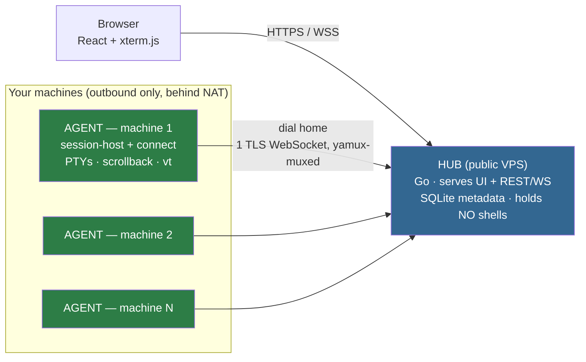

# 01 · Overview

**Constellate is a self-hosted control plane for a fleet of developer machines.** One web UI, served
from a single public **hub**, gives one operator live, persistent terminal access to every machine
they own — grouped by project, reconnectable from any device, with a mission-control **overview** of
every running shell at a glance.

It collapses the two axes you juggle today — one terminal tab per project, one SSH session per
machine — into a single browser tab. It is deliberately a **single-operator** tool for **machines you
already own**: not a multi-tenant PaaS, not an environment provisioner, not a web IDE.

---

## The shape of the system



**Agents dial home** — the hub never connects *into* a machine. Dev boxes need zero inbound ports and
work behind NAT. Each agent holds exactly one TLS WebSocket carrying many
[yamux](https://github.com/hashicorp/yamux) streams (control, per-session data, snapshots). The hub
is a pure control plane and relay; the PTYs live on the agents.

---

## The stack (what's actually in `go.mod` / `package.json`)

| Concern | Choice | Notes |
|---------|--------|-------|
| Language (hub + agent) | **Go 1.25** | one module `github.com/rizquuula/Constellate`, two bounded contexts |
| Static binaries | `CGO_ENABLED=0` everywhere | pure-Go deps only → distroless/scratch images |
| WebSocket | `github.com/coder/websocket` v1.8.14 | `NetConn()` adapts the socket to `net.Conn` for yamux |
| Multiplexing | `github.com/hashicorp/yamux` v0.1.2 | many streams over one conn, built-in backpressure/keepalive |
| PTY | `github.com/creack/pty` v1.1.24 | spawn / resize / reap |
| Store | `modernc.org/sqlite` v1.52.0 | **pure Go**, no cgo |
| IDs | `github.com/oklog/ulid/v2` v2.1.1 | time-sortable machine/session ids |
| Config | `gopkg.in/yaml.v3` | YAML file + `CONSTELLATE_*` env overrides |
| Logging | stdlib `log/slog` | structured, leveled |
| WebAuthn | `github.com/go-webauthn/webauthn` v0.17.4 | operator passkeys |
| TOTP + recovery | `github.com/pquerna/otp` v1.5.0 | primary operator factor |
| Host metrics | `github.com/shirou/gopsutil/v4` v4.26.5 | CPU/RAM + live `pwd` (cgo-free) |
| VT/ANSI emulator | **in-repo, pure Go** | Williams parser + ECMA-48/VT100; not a dependency |
| Frontend | **React 18 + xterm.js 5** | Vite 6 build, embedded into the hub binary via `go:embed` |
| Frontend state | **zustand 4** | plus `@dnd-kit/core` (drag), `react-resizable-panels` (splits) |

> ### ⚠️ Drift: `DESIGN.md` §13 overstates the frontend stack
> `DESIGN.md` lists "**zustand + TanStack Query · React Router · Tailwind CSS**" and
> "`@xterm/addon-fit` + `@xterm/addon-webgl`". The code (`web/package.json`) uses **only** zustand,
> and **only** `@xterm/addon-fit`. There is **no TanStack Query** (server state is a manual 2 s
> `setInterval` in `web/src/App.tsx:157-171`), **no React Router** (routing is `window.location.hash`
> in `web/src/store/index.ts:58-67`), **no Tailwind** (plain CSS in `web/src/styles.css`), and **no
> webgl addon**. It *does* use `@dnd-kit/core`, which `DESIGN.md` omits. See [07 · Frontend](07-frontend.md).

---

## Goals & non-goals (`DESIGN.md` §2, matched to the code)

**Goals (all shipped):**

- **G1** — a live interactive shell in the browser, per machine.
- **G2** — persistent sessions: survive tab close, sleep, network change, and connect restarts.
- **G3** — projects: sessions grouped by project across the fleet, not a flat host list.
- **G4** — mission-control overview: every live terminal as a tile; click to dive.
- **G5** — a progress dashboard: status/activity rollups fleet-wide.

**Non-goals (deliberate):** multi-user / teams / RBAC · provisioning machines or environments · a full
web IDE · file sync / large transfers (use `scp`/`rsync`).

---

## Where the code lives

```
cmd/            composition roots (wiring only): cmd/hub, cmd/agent
internal/hub/       HUB bounded context (control plane)     — a hexagon
internal/agent/     AGENT bounded context (per machine)     — a hexagon
internal/transport/ shared wire protocol (both import it)
internal/platform/  shared cross-cutting: log · id · config · version · cli
web/            React + xterm.js app, built to web/dist, embedded via web/embed.go
deploy/         Dockerfiles, compose stacks, Caddyfile, systemd units, entrypoints
configs/        hub.example.yaml · agent.example.yaml
test/           integration/ (in-proc) · e2e/ (Playwright) · docker/ (topology)
```

The two `internal/*` hexagons **never import each other** — they share only `internal/transport` and
`internal/platform`. That rule is the backbone of [02 · Architecture](02-architecture.md).

---

## Where to go next

| You want to understand… | Read |
|-------------------------|------|
| The two hexagons, layering, and the bidirectional agent link | [02 · Architecture](02-architecture.md) |
| The durable/volatile agent split, PTYs, scrollback, the vt emulator | [03 · Agent & sessions](03-agent-and-sessions.md) |
| Every wire message, the three streams, the snapshot encoding | [04 · Wire protocol](04-wire-protocol.md) |
| The SQLite schema and its six migrations | [05 · Data model](05-data-model.md) |
| REST + WebSocket endpoints and error codes | [06 · API reference](06-api-reference.md) |
| The web app: views, split-panes, terminals, dashboard | [07 · Frontend](07-frontend.md) |
| The signature overview snapshot pipeline (and *why* it's cheap) | [08 · Overview pipeline](08-overview-pipeline.md) |
| Enrollment, operator auth, TLS, the threat model | [09 · Security](09-security.md) |
| Config, deploy, install/update, releases, troubleshooting | [10 · Operations](10-operations.md) |
| The test pyramid and CI | [11 · Testing](11-testing.md) |
| **Task guides** (hand-written, user-facing) | [`usage.binary.md`](usage.binary.md) · [`usage.docker.md`](usage.docker.md) · [`usage.agent.md`](usage.agent.md) · [`shell-integration.md`](shell-integration.md) · [`hub.shortcut.md`](hub.shortcut.md) |
