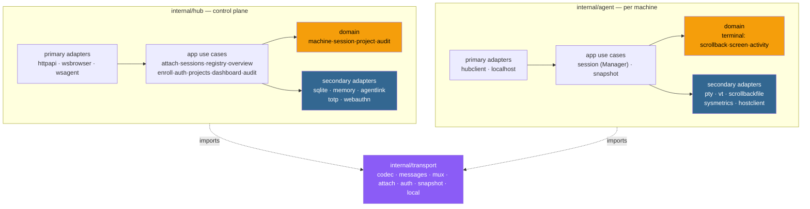
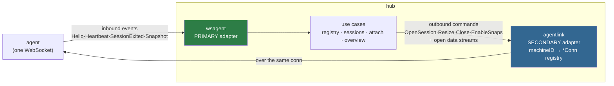
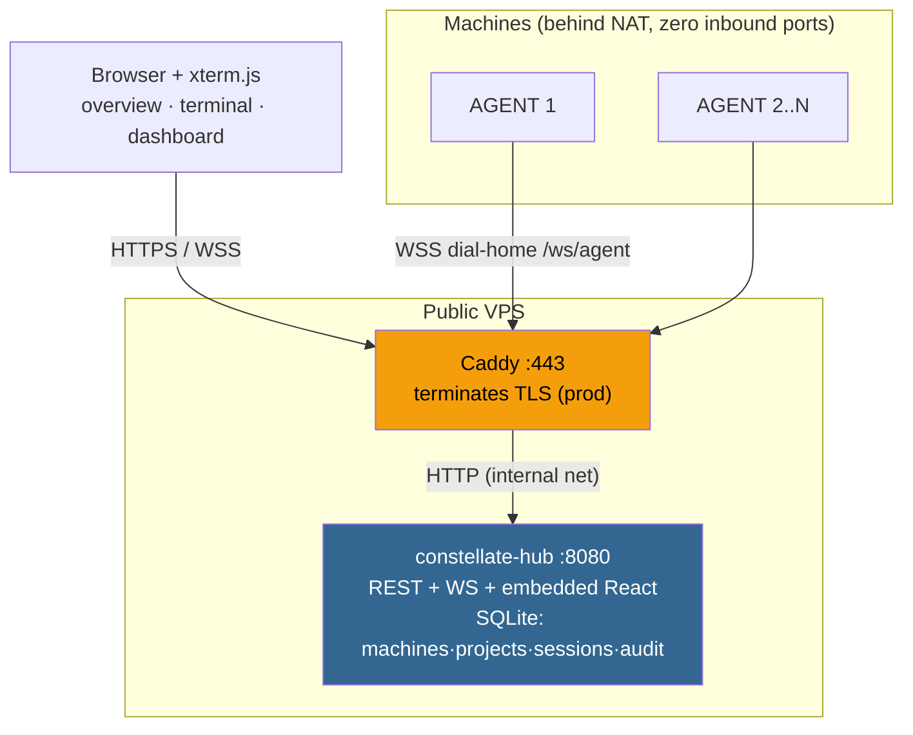
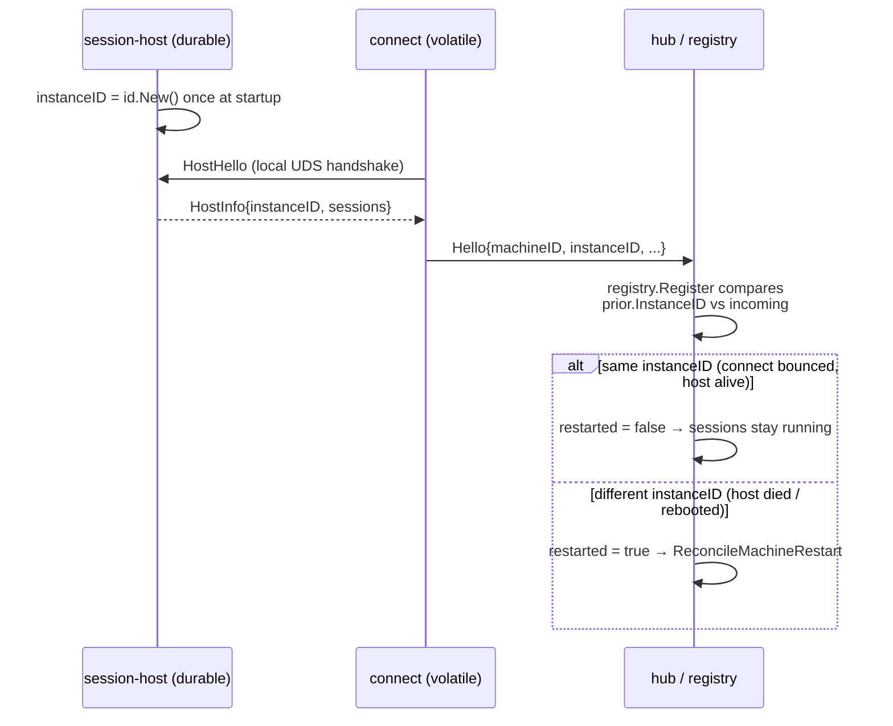

# 02 · Architecture

Constellate is **two hexagons in one Go module** — `internal/hub` and `internal/agent` — sharing only
`internal/transport` (the wire protocol) and `internal/platform` (log/id/config/version/cli).
**Neither bounded context imports the other.** That is the single rule everything else hangs off.

---

## The two hexagons

**Layering rules** (`CLAUDE.md`, enforced by review + lint):

- **domain/** (`*/domain/*`) — pure stdlib, business types with behavior, no infra imports. Domain
  tests run in milliseconds.
- **app/`<usecase>`** — one `UseCase` type per package; *glue, not logic*. Each package declares the
  SPI interfaces **it** needs in its own `ports.go` (consumer-side; there is no central `port/`
  package). Ports are shaped by the core's needs — `MachineStore.ByID(ctx, id)`, never
  `Query(ctx, sql, ...)`.
- **adapter/primary/** (driving) and **adapter/secondary/** (driven). Secondary adapters wrap infra
  errors into domain errors (`sql.ErrNoRows → machine.ErrNotFound`) and keep DTOs out of the core.
- **`cmd/*/main.go`** is the only composition root — plain constructors wire concrete adapters into
  use cases; the compiler verifies the graph.

---

## The one subtlety: the agent link is *both* a primary and a secondary adapter

From the hub's point of view, a single physical agent WebSocket sits on **both** sides of the hexagon:

Inbound agent events **drive** use cases (primary); use cases **drive** outbound commands through
`agentlink` (secondary). Both share the one `machineID → *Conn` registry
(`internal/hub/adapter/secondary/agentlink/registry.go`) but sit on opposite edges of the hexagon —
which is exactly correct, not a leak.

---

## The stream model — yamux over one WebSocket

Each agent holds exactly one WebSocket, wrapped as a `net.Conn` and run as a **yamux** session
(`internal/transport/mux.go`). Logical streams:

| Stream | Opened by / accepted by | Direction | Carries |
|--------|-------------------------|-----------|---------|
| **control** (first) | agent-opened / hub-accepted | bidirectional | NDJSON: `Hello`, `Heartbeat`, `OpenSession`, `Resize`, `CloseSession`, `SessionOpened`, `SessionExited`, `EnableSnaps`, `Error` |
| **data** (one per attached session) | **hub-opened / agent-accepted** | bidirectional | first line `AttachHeader{sessionID}` (NDJSON), then raw PTY bytes |
| **snapshot** (one per agent) | agent-opened / hub-accepted | agent → hub | first line `SnapStreamHeader`, then RLE `Snapshot` records; gated by `EnableSnaps` |

One socket ⇒ one TLS handshake, one auth check, one thing to reconnect — while every terminal still
gets its own back-pressured byte pipe. Full message reference in [04 · Wire protocol](04-wire-protocol.md).

---

## Deployment topology

The hub **never initiates** a connection into a machine. In production, **Caddy** owns 80/443 and
terminates TLS, reverse-proxying plain HTTP to the hub on an internal Docker network (the hub is never
published directly). The hub can also terminate TLS itself via `tls.cert`/`tls.key`. See
[10 · Operations](10-operations.md).

---

## Restart detection — the `instanceID` lever

The whole "did we lose the sessions?" decision keys on one value: the session-host's `instanceID`.

The comparison is exactly three conditions in `registry.UseCase.Register`
(`internal/hub/app/registry/usecase.go:56-72`): a prior record exists, both prior and incoming
`instanceID` are non-empty, **and** they differ. Because `connect` sources its `instanceID` from the
still-running session-host, a connect-only restart reports the *same* id → `restarted=false` →
nothing is marked lost. This is the entire payoff of the [session-host / connect split](03-agent-and-sessions.md).

`ReconcileMachineRestart` (`internal/hub/app/sessions/usecase.go:147-179`) then either revives
`auto_relaunch=1` sessions (re-`OpenSession` with `revive=true`, same id, scrollback preserved) or
sweeps the rest to `lost` via `MarkRunningLost`. It runs in a **new goroutine** from
`wsagent/inbound.go` deliberately — `OpenSession` blocks on the same control read-loop that would
resolve `SessionOpened`, so a synchronous call would deadlock.

---

## Use-case ↔ port map (hub)

Each app package declares only the SPI it needs. This is the dependency-inversion surface.

| Use case | Responsibility | Key ports (`ports.go`) |
|----------|----------------|------------------------|
| `registry` | register / heartbeat / list machines; online + metrics overlay; restart detection | `MachineStore`, `LiveAgents{IsOnline,OnlineIDs,Metrics}`, `Clock` |
| `sessions` | open/close/delete/rename session metadata; exit + restart reconciliation; `RecordStat` | `SessionStore`, `AgentGateway{OpenSession,CloseSession}`, `AuditSink`, `Clock` |
| `attach` | broker a browser ↔ agent data stream; resize | `SessionStore`, `AgentGateway{OpenDataStream,Resize}`, `AuditSink` |
| `overview` | cache latest snapshot per session; fan out to viewers; gate `EnableSnaps` | `SnapshotControl{SetSnapshotsEnabled}`, `Subscriber{Send}` |
| `enroll` | token mint / redeem; Ed25519 auth; revoke | `EnrollTokenStore`, `CredentialStore`, `MachineStore`, `AuditSink`, `Clock`, `IDGen` |
| `auth` | operator TOTP/recovery/WebAuthn + sessions | `OperatorStore`, `WebAuthn`, `ChallengeStore`, `SessionStore`, `TOTP`, `AuditSink`, `Clock` |
| `projects` | project CRUD with session-owned-delete guard | `ProjectStore`, `SessionCounter{CountByProject}`, `Clock` |
| `dashboard` | read-side aggregation into one `View` | `MachineStore`, `LiveAgents`, `SessionStore`, `ProjectStore`, `AuditReader` |
| `audit` | append security events | `AuditStore{Append}`, `Clock` |

Every secondary port has **two** implementations: a `sqlite` adapter (production) and a `memory`
adapter (tests / fakes) — see [11 · Testing](11-testing.md).

---

## Where to go next

- Inside a machine: [03 · Agent & sessions](03-agent-and-sessions.md)
- The messages crossing these boundaries: [04 · Wire protocol](04-wire-protocol.md)
- What the ports read/write: [05 · Data model](05-data-model.md)
