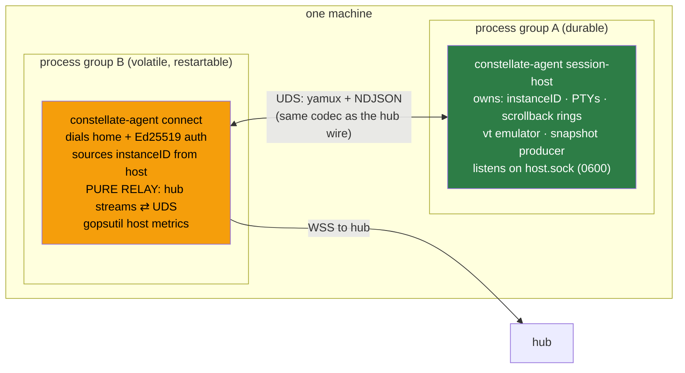
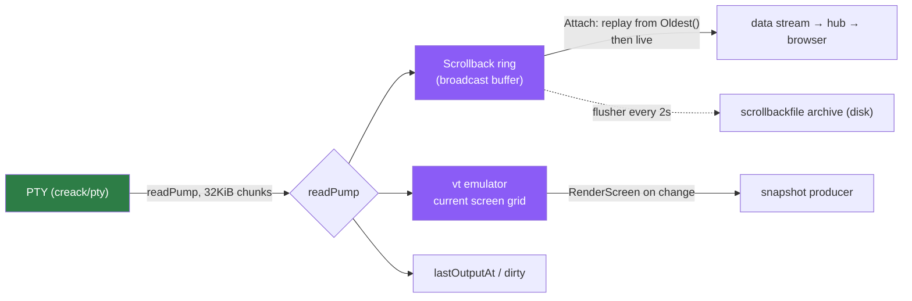
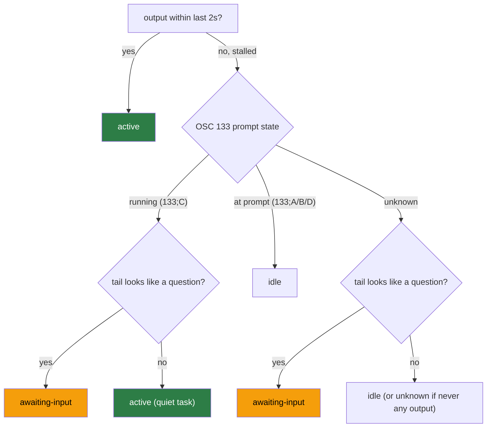

# 03 · Agent & sessions

Inside each machine the agent is **two cooperating processes from one static binary**, talking over a
Unix domain socket. This split (decision **D8**, supersedes D6) is what makes sessions survive an
agent restart.



| | **session-host** (durable) | **connect** (volatile) |
|---|---|---|
| Owns | `instanceID`, all PTYs, scrollback rings, vt emulator, snapshot producer | nothing persistent — it's a relay |
| Lifetime | survives connect restarts and `agent update` | safe to kill; systemd `Restart=always` | 
| systemd unit | `constellate-session-host.service` (`Restart=on-failure`) | `constellate-agent.service` (`Restart=always`, `Requires=` the host) |
| Dies ⇒ | sessions **lost** (PTYs die with it) | sessions **survive**; hub sees same `instanceID` |

`instanceID` is generated exactly once — `id.New()` at `cmd/agent/main.go:327` inside
`cmdSessionHost`. `connect` never generates one; it reads the host's via `hc.InstanceID()`
(`cmd/agent/main.go:226`) and reports that in every `Hello`. That is why a connect bounce is invisible
to the hub's [restart detection](02-architecture.md#restart-detection--the-instanceid-lever).

> ### ⚠️ Drift: `DESIGN.md` §12 names `spawn_linux.go`; the file is `spawn_unix.go`
> The auto-spawn code is `cmd/agent/spawn_unix.go` (build tag `//go:build unix`) plus a
> `spawn_windows.go` stub — not `spawn_linux.go` as the `DESIGN.md` tree states. The behavior is as
> documented.

---

## Auto-spawn: connect brings the host up if it's absent

When `connect` starts and the socket doesn't answer, it daemonizes a session-host:

1. `socketResponds(socketPath)` — dial with a 500 ms timeout; if it answers, no-op
   (`spawn_unix.go:88-95`).
2. Otherwise `os.StartProcess(self, [self, "session-host", --config …], …)` with
   `SysProcAttr{Setsid: true}` (`spawn_unix.go:60-64`) — the child gets its **own** session/process
   group so it outlives connect. `proc.Release()` — fire-and-forget.
3. Child stdio → a `host.log` next to the socket; connect polls the socket for up to 10 s
   (`spawn_unix.go:76-84`).

Under systemd the two units achieve the same ordering declaratively — the connect unit
`Requires=`/`After=` the host unit, so the host starts first.

---

## The local protocol (connect ⇄ session-host)

The UDS link reuses the **exact same** yamux + NDJSON codec as the hub wire protocol — no second
encoding (`internal/transport/local.go`). Roles simply invert: the **host is the yamux server**
(accepts streams), **connect is the yamux client** (opens them).

| Local stream | Opener / accepter | Carries |
|--------------|-------------------|---------|
| local-control (first) | connect-opened / host-accepted | `HostHello` → `HostInfo` handshake, then `OpenSession`/`Resize`/`CloseSession`/`EnableSnaps`/`ListSessions`/`LocalStat`/`Error` |
| local-data (per session) | connect-opened / host-accepted | `AttachHeader{sessionID}` + raw PTY bytes |
| local-snapshot (per connect) | host-opened / connect-accepted | `SnapStreamHeader` + `Snapshot` frames, relayed on to the hub |

Handshake: connect sends `HostHello{localProtocol}`; host replies
`HostInfo{instanceID, localProtocol, sessions[]}`. Each side negotiates
`min(localProtocol, LocalProtocolVersion)` where `LocalProtocolVersion = 3`. Because frames are NDJSON
with `type` tags and unknown fields are ignored, a v2/v3 pair interoperates in both directions — v3
adds only `LocalSessionActivity.pwd`, additive.

**Hardening** (`internal/agent/adapter/primary/localhost/server.go`):

- **Single-client lease** — a `sync.Mutex.TryLock` on accept; a second connect gets
  `Error{code:"host_busy"}` and is closed.
- **Peer-UID check** — `checkPeerCred` calls `SO_PEERCRED` (`peercred_linux.go`) and rejects any
  connection whose peer uid ≠ the host's own uid. Linux-only; a stub no-ops elsewhere.
- Socket is `0600` inside a `0700` runtime dir (default `$XDG_RUNTIME_DIR/constellate/host.sock`).

---

## The session manager — where PTYs, scrollback, and the screen live

`internal/agent/app/session/manager.go`. Every session is one `liveSession`:

```go
type liveSession struct {
    pty          PTY
    sb           *terminal.Scrollback  // bounded ring buffer
    screen       Screen                // vt emulator; nil if no ScreenFactory
    lastOutputAt atomic.Int64          // unix-sec of most recent PTY output
    dirty        atomic.Int32          // set by readPump, cleared by the flusher
}
```



The crucial property: **`readPump` runs unconditionally** (`manager.go:482-512`) — it drains the PTY
into scrollback *and* the vt screen whether or not any client is attached. That is why:

- closing the browser tab loses nothing — output keeps filling the ring;
- `connect` can be absent for minutes and the host keeps buffering;
- the overview screen is instantly correct the moment a viewer connects.

**Attach** (`manager.go:154-210`) spawns a drain goroutine that reads `sb.ReadFrom(cursor, stop)` from
`sb.Oldest()` — replaying retained history to the new stream — then blocks for live output; a second
goroutine `io.Copy`s the client's keystrokes into the PTY.

**Open with restart recovery** (`manager.go:99-148`): if a scrollback archive exists on disk, it is
loaded and seeded into the new ring with a visible marker line
`──── session restored after restart ────`. **Close** (`manager.go:227-242`) *deletes* the archive —
an explicit close is not a restart. **Shutdown** (SIGTERM) flushes all archives first (`FlushAll`,
then `main.go:374`) so a clean session-host stop can be resumed.

### The scrollback ring (`domain/terminal/scrollback.go`)

A bounded byte buffer with absolute offsets and a **broadcast** wake channel: every `Write`/`Close`
replaces+closes a `wait` channel so all blocked `ReadFrom` readers wake at once. Default cap is
`256 * 1024` = **262144 bytes** (`scrollback.go:5`), overridable via `scrollback_bytes` config. Oldest
bytes are evicted first; a reader whose cursor fell behind eviction is clamped forward to `start`.

> Scrollback lives in **host RAM** (optionally mirrored to disk by the archive for restart-recovery).
> It is not a durable log — a machine reboot or a session-host crash empties it, by design.

---

## The vt emulator — an in-repo, pure-Go terminal

`internal/agent/adapter/secondary/vt`. Deliberately **not** a third-party dependency, to keep
`CGO_ENABLED=0` and a self-contained module; it sits behind the `Screen` port so it is swappable.

- **`parser.go`** — the canonical **Paul Williams ANSI state machine** (`stGround`, `stEscape`,
  `stCSIEntry`, `stOSCString`, `stDCSPassthrough`, …). One `feedByte` transition function per byte.
- **`emulator.go`** — dispatch + the cell grid: primary/alt screens, cursor + saved-cursor, scroll
  regions (DECSTBM), alt-screen modes (47/1047/1049), a `rev`/`dirty` revision counter, and a UTF-8
  continuation buffer for multibyte runes split across writes. `Render()` deep-copies the grid only
  when `dirty`.
- **`sgr.go`** — SGR color: 16-color, `38;5;n`/`48;5;n` 256-color, `38;2;r;g;b` truecolor, plus
  bold/faint/italic/underline/blink/inverse/hidden/strike.
- **OSC 133** — `133;A/B/D` → *at prompt*, `133;C` → *running command*. `TailText()` returns the
  cursor row's text (or the last non-blank row) to feed the question heuristic.

---

## Activity detection (`domain/terminal/activity.go`)

Per-session activity is one of `active`, `idle`, `awaiting-input`, `unknown`, computed by
`ComputeActivity(now, lastOutputAt, activeWindowSec=2, promptState, tailLooksLikeQuestion)`:



The question heuristic (`TailLooksLikeQuestion`) matches a fixed set of substrings — `(y/n)`,
`[y/n]`, `(yes/no)`, `password:`, `passphrase:`, `continue?`, `proceed?`, `overwrite?`, `do you want`,
`press enter`, `press any key`, `❯` — plus a bare trailing `?` **only** on lines ≤ 60 runes (so long
prose lines don't false-positive). Without OSC 133 (prompt state `unknown`) this heuristic plus output
timing is the entire signal — see [`shell-integration.md`](shell-integration.md) to add the markers.

Activity ships in each `Heartbeat` as `SessionStat.activity`; the live working directory ships
alongside as `SessionStat.pwd` (read from the PTY child's `/proc/<pid>/cwd`, or gopsutil elsewhere,
**outside** the manager lock since it's a syscall).

---

## Where to go next

- The exact bytes on the wire: [04 · Wire protocol](04-wire-protocol.md)
- How snapshots become overview tiles: [08 · Overview pipeline](08-overview-pipeline.md)
- Running the agent as a service: [`usage.agent.md`](usage.agent.md)
