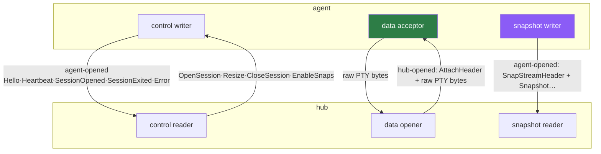

# 04 · Wire protocol

Everything on the hub↔agent link (and the connect↔host local link) is defined in
`internal/transport`, imported by **both** bounded contexts. Protocol DTOs are translated into each
side's domain types at the adapter boundary and never leak into a use case.

---

## Versioning — one int, a compat window

```go
// internal/transport/protocol.go
const ProtocolVersion      = 6   // what an agent advertises in Hello
const MinSupportedProtocol = 1
const MaxSupportedProtocol = 6   // the hub's accept window is [1, 6]
```

| Version | Adds |
|---------|------|
| 1 | control + data streams |
| 2 | `EnableSnaps` (hub→agent) + the agent-opened snapshot stream |
| 3 | `SessionStat.activity` in `Heartbeat` |
| 4 | `Heartbeat.metrics` (host CPU/RAM via gopsutil) |
| 5 | `OpenSession.Revive` (restart auto-relaunch hint) |
| **6** | `SessionStat.pwd` (live working directory) |

Every addition is **additive** — a peer at an older version simply ignores the unknown JSON field.

> ### ⚠️ Drift: the current protocol is **6**, not 2 or 5
> `DESIGN.md` §6 says "protocol stays **2**" (that sentence is frozen at the M5 auth milestone) and
> §13/§18 say "**5**". `CLAUDE.md` says "**6** (supported window [1,6])". The code
> (`internal/transport/protocol.go:38-42`) is authoritative: `ProtocolVersion = 6`,
> `MaxSupportedProtocol = 6`. `CLAUDE.md` is correct; the `DESIGN.md` prose is stale in two places.

> **Compatibility is one-directional.** An agent advertises a single version, not a range, so a
> **new agent is rejected by an old hub** (`unsupported_protocol`). Operational rule:
> **upgrade the hub before the agents.** New-hub / old-agent degrades cleanly (missing fields stay
> zero-valued). `LocalProtocolVersion = 3` governs the connect↔host UDS link independently.

---

## The three streams



- **control** — agent-opened / hub-accepted (`hubclient/client.go:395` opens it right after
  `transport.Client`). NDJSON, bidirectional.
- **data** — **hub-opened / agent-accepted**. First line is `AttachHeader{sessionID}` (NDJSON), then
  raw, unframed PTY bytes both ways — it is a byte pipe; xterm talks straight to the shell.
- **snapshot** — agent-opened / hub-accepted, one per agent connection, NDJSON. First line
  `SnapStreamHeader{type:"SnapStream"}` distinguishes it from a data stream; every line after is one
  `Snapshot`. Gated by `EnableSnaps` — [08 · Overview pipeline](08-overview-pipeline.md).

**`/ws/term` frame convention** (browser side): terminal I/O rides **binary** WebSocket frames;
resize rides **text** frames `{"type":"resize","cols":…,"rows":…}`. The hub translates between the
browser WebSocket and the yamux data stream.

---

## Message catalogue (`internal/transport/messages.go`)

`type` tag on every frame; `codec.Decoder.Next()` peeks the tag, then `Unmarshal[T]` re-parses the raw
line into the concrete struct — unknown fields are silently dropped, which is exactly how additive
versions coexist.

### Agent → hub (control)

| Message | Fields |
|---------|--------|
| `Hello` | `machineID`, `instanceID`, `name`, `os`, `arch`, `agentVersion`, `protocolVersion` |
| `Heartbeat` | `ts`, `sessions []SessionStat`, `metrics *Metrics` (omitempty) |
| `SessionStat` (in Heartbeat) | `id`, `status`, `bytesOut`, `activity?`, `pwd?` |
| `Metrics` (in Heartbeat) | `cpuPercent` (`-1` if unavailable), `memUsedMB`, `memTotalMB` |
| `SessionOpened` | `sessionID`, `pid` |
| `SessionExited` | `sessionID`, `exitCode` |
| `Error` | `sessionID?`, `code`, `message` |

### Hub → agent (control)

| Message | Fields |
|---------|--------|
| `OpenSession` | `sessionID`, `cwd`, `shell`, `cols`, `rows`, `createDir?`, `revive?` |
| `Resize` | `sessionID`, `cols`, `rows` |
| `CloseSession` | `sessionID` |
| `EnableSnaps` | `enabled` |

### Data / snapshot stream headers

| Message | Fields | Stream |
|---------|--------|--------|
| `AttachHeader` (`type:"attach"`) | `sessionID` | data — first line |
| `SnapStreamHeader` (`type:"SnapStream"`) | — | snapshot — first line |
| `Snapshot` | see below | snapshot |

### Local-only (connect ⇄ host, `internal/transport/local.go`)

| Message | Direction | Fields |
|---------|-----------|--------|
| `HostHello` | connect → host | `localProtocol` |
| `HostInfo` | host → connect | `instanceID`, `localProtocol`, `sessions []SessionStub{id,pid}` |
| `ListSessions` | connect → host | — |
| `LocalStat` | host → connect | `activities []LocalSessionActivity{id, activity, pwd?}` |

The local control dispatcher (`localhost/server.go`) is structurally near-identical to the hub
dispatcher (`hubclient/control.go`) — the same `OpenSession`/`Resize`/`CloseSession`/`EnableSnaps`
switch, one layer down.

---

## The agent-signed bearer assertion (`internal/transport/auth.go`)

Dial-home authentication rides the WebSocket upgrade's `Authorization: Bearer` header — no
wire-protocol change, works behind any TLS-terminating proxy.

```
token   =  v1.<machineID>.<unixTs>.<base64url-nopad-sig>
signed   =  ed25519.Sign(priv, "constellate-agent-auth.v1.<machineID>.<unixTs>")
```

- `BuildAgentToken` (agent side) signs the canonical string with the machine's Ed25519 **private**
  key.
- `VerifyAgentToken` (hub side) checks `|now − unixTs| ≤ 120 s` skew, then `ed25519.Verify` against
  the stored **public** key. **The hub holds no signing secret** — only public keys in
  `machine_credentials`.

Set on the dial in `hubclient/client.go:369-376`. Revocation is soft: a non-NULL `machines.revoked_at`
makes `enroll.Authenticate` reject before signature verification even matters. See
[09 · Security](09-security.md).

---

## The snapshot record — RLE, full-color (`internal/transport/snapshot.go`)

```jsonc
// SnapStreamHeader precedes the first Snapshot on the stream
{ "type": "SnapStream" }
{
  "type": "Snapshot",
  "sessionID": "01J…", "machineID": "01J…",
  "cols": 120, "rows": 32,
  "cursor": { "x": 4, "y": 7, "visible": true },
  "lines": [ { "runs": [ { "t": "$ ls", "f": 2, "b": 0, "a": 1 } ] } ],
  "rev": 42
}
```

- `lines` has length `rows`, top-to-bottom; each row is **run-length encoded** — adjacent cells with
  identical fg/bg/attrs collapse to one `SnapRun`. Concatenated run text spans exactly `cols` columns
  (trailing blanks may be omitted).
- `SnapRun` = `{ t: text, f?: fg, b?: bg, a?: attrs }` (`f`/`b`/`a` omitted when default/zero).
- **Color** (one int): `0` = terminal default; `1..256` = palette index + 1 (0–15 ANSI, 16–255
  xterm-256); `≥ 0x1000000` = truecolor, RGB in the low 24 bits.
- **Attr bits**: bold 1, faint 2, italic 4, underline 8, blink 16, inverse 32, hidden 64, strike 128.
- **`rev`** increments *only* when the visible screen changed, so a session's snapshot is sent only on
  actual change (plus one forced frame when a viewer connects). This is the change-gate that keeps
  overview bandwidth near-constant — [08 · Overview pipeline](08-overview-pipeline.md).

---

## Codec & mux

- **`codec.go`** — NDJSON. `Encoder.Encode` is mutex-guarded and flushes every call;
  `Decoder.Next` returns a `Frame{Type, Raw}` and `Unmarshal[T]` re-parses on demand. NDJSON was
  chosen for on-the-wire debuggability; the `codec` package isolates it so msgpack/protobuf could
  replace it without touching a use case.
- **`mux.go`** — thin `Server(net.Conn)` / `Client(net.Conn)` wrappers over `yamux.DefaultConfig()`
  (logging discarded). yamux provides per-stream flow control and keepalive.

---

## Where to go next

- Who opens what, and the session manager behind the data stream: [03 · Agent & sessions](03-agent-and-sessions.md)
- The HTTP/WS endpoints that terminate these streams: [06 · API reference](06-api-reference.md)
- The overview's use of the snapshot stream: [08 · Overview pipeline](08-overview-pipeline.md)
