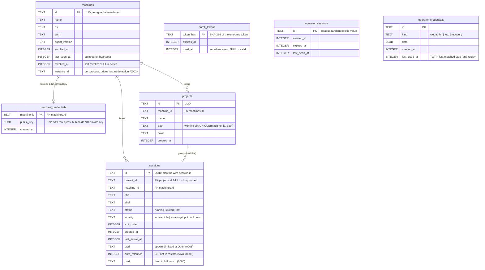
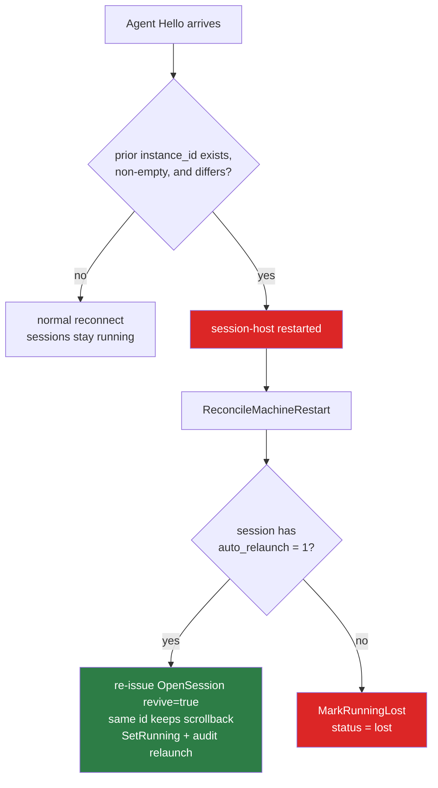

# 05 · Data model

The hub keeps **metadata and history only** in one SQLite file (`modernc.org/sqlite`, pure-Go, so
the binary stays `CGO_ENABLED=0` static). Live PTY state — scrollback rings, the vt screen, the PTYs
themselves — lives in the **session-host process RAM** on each machine and is never written to disk.
See [03 · Agent & sessions](03-agent-and-sessions.md) for what the agent holds.

> Ground truth for this page is the six migration files in
> `internal/hub/adapter/secondary/sqlite/migrations/` and the domain types in
> `internal/hub/domain/`. Timestamps are unix **seconds** (`INTEGER`). All ids are ULIDs
> (`internal/platform/id/id.go`), time-sortable, generated at creation.

---

## Entity–relationship



`enroll_tokens`, `operator_sessions`, and `operator_credentials` stand apart — they hold **auth
state**, not fleet topology, so they carry no FK to `machines`. `operator_credentials.kind`
discriminates a generic key/value row into a TOTP secret, a recovery-code hash, or a WebAuthn
credential blob (there is exactly one operator).

---

## Migration history

Migrations are embedded SQL (`//go:embed`) and applied at hub startup (`sqlite/migrate.go`), also
runnable standalone via `constellate-hub migrate`. Read them as the schema's changelog — each later
one tells you *why a column exists*.

| # | File | Change | Why it landed |
|---|------|--------|---------------|
| 0001 | `0001_init.sql` | Baseline: `machines`, `machine_credentials`, `projects`, `sessions`, `audit_log`, `operator_credentials` | The whole fleet model in one shot. |
| 0002 | `0002_machine_instance.sql` | `ALTER machines ADD instance_id TEXT` | The single lever for **restart detection**. A changed `instance_id` on a re-`Hello` means the session-host process actually restarted (vs. a mere reconnect). See [02 · Architecture](02-architecture.md#restart-detection). |
| 0003 | `0003_enroll_tokens.sql` | New `enroll_tokens(token_hash PK, expires_at, used_at)` | Backs one-time agent enrollment: `hub enroll-token` mints, `POST /api/enroll` consumes. The hub stores only the **SHA-256** — the plaintext token is shown once and never persisted. |
| 0004 | `0004_operator_sessions.sql` | New `operator_sessions(id PK, created_at, expires_at, last_seen_at)` + `idx_operator_sessions_expires` | Server-side sessions behind the opaque `constellate_session` cookie (24 h). |
| 0005 | `0005_session_relaunch.sql` | `ALTER sessions ADD cwd TEXT`; `ALTER sessions ADD auto_relaunch INTEGER NOT NULL DEFAULT 0` | Opt-in **session survival across a session-host restart**: `cwd` records the fixed spawn dir so the hub can re-issue `OpenSession` at the original directory; `auto_relaunch` gates it (default OFF). |
| 0006 | `0006_session_pwd.sql` | `ALTER sessions ADD pwd TEXT` | The session's **live** working directory (follows `cd`), distinct from the fixed `cwd`. Refreshed from each heartbeat; drives the pane-header path chip. |

> **`cwd` vs `pwd` — they are different columns on purpose.** `cwd` is the spawn directory captured
> once at `OpenSession` and never updated; `pwd` is the live directory the shell is actually in.
> Showing `cwd` after the user ran `cd` would lie, so a separate live field was added
> (`domain/session/session.go:17-21`). Heartbeat ingest writes both in one `UPDATE` via the store's
> `SetStat`, each guarded by `COALESCE(NULLIF(?, ''), col)` so an agent that cannot read the pwd
> (macOS `EPERM`, an exited process) never clobbers a known value with an empty string.

---

## Status & activity enums

Quote the real constant values, not paraphrases — these strings are what land in the `status` and
`activity` columns and cross the wire.

| Field | Constants (`domain/session/status.go`) | Meaning |
|-------|----------------------------------------|---------|
| `sessions.status` | `running` · `exited` · `lost` | `running` live; `exited` closed cleanly (has `exit_code`); `lost` the session-host died under it (see below). |
| `sessions.activity` | `active` · `idle` · `awaiting-input` · `unknown` | Derived on the agent (output timing + OSC 133 + screen-tail heuristic); surfaced as the sidebar/overview/dashboard badge. |

`machines` liveness (`online` / `offline`, `domain/machine/status.go`) is **not** stored — it is
computed live from the in-memory `agentlink.Registry` at read time. `machines.revoked_at` is stored
and permanent-ish: `enroll.Authenticate` rejects any machine with a non-NULL `revoked_at`.

### When does a session become `lost`?



The comparison that fires all of this is exactly three conditions in `registry.UseCase.Register`
(`internal/hub/app/registry/usecase.go:56-72`): a prior record must exist, **both** instance ids
non-empty, and they must differ. A connect-only restart keeps the same session-host `instance_id`,
so `restarted=false` and nothing is marked lost — that is the whole point of the
[session-host / connect split](03-agent-and-sessions.md).

---

## The audit log

```sql
audit_log (
    id         INTEGER PRIMARY KEY AUTOINCREMENT,
    ts         INTEGER NOT NULL,
    actor      TEXT NOT NULL,   -- operator id | "system"
    action     TEXT NOT NULL,
    machine_id TEXT,
    session_id TEXT,
    detail     TEXT             -- JSON
);
-- idx_audit_ts on (ts)
```

`action` is a closed set (`domain/audit/event.go`): `login`, `enroll`, `attach`, `open`, `close`,
`delete`, `revoke`, `relaunch`. Events are written through the `AuditSink` consumer port from the
`attach`, `sessions`, `enroll`, and `auth` use cases — never directly from a handler. The dashboard
surfaces the **20 most recent** rows as its activity feed.

---

## Where to go next

| You want… | Go to |
|-----------|-------|
| How these rows are read/written (use cases, ports) | [02 · Architecture](02-architecture.md) |
| The REST/WS endpoints that expose this data | [06 · API reference](06-api-reference.md) |
| How `instance_id` is generated and relayed | [03 · Agent & sessions](03-agent-and-sessions.md) |
| Enrollment tokens, cookies, TOTP internals | [09 · Security](09-security.md) |
