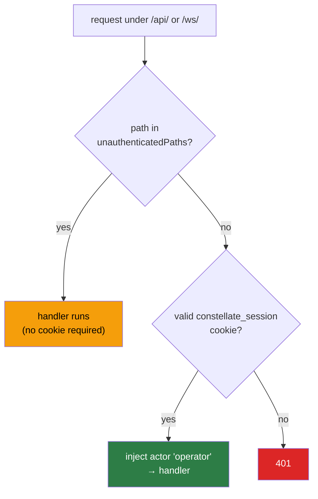
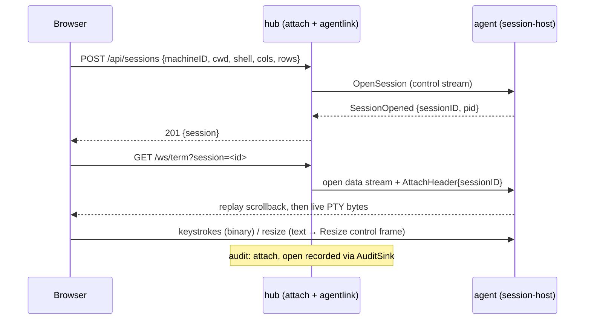

# 06 · API reference

All routing is wired in `internal/hub/adapter/primary/httpapi/server.go`, behind the chain
`loggingMiddleware(authMiddleware(mux))`. Every path under `/api/` or `/ws/` is **gated by the
operator session cookie** unless it appears in the exact-match allowlist.

---

## Auth gating

**Allowlist** (`middleware.go:20-29`, exact match):
`/api/enroll`, `/api/auth/totp`, `/api/auth/recovery`, `/api/auth/status`, `/api/auth/logout`,
`/api/auth/webauthn/login/begin`, `/api/auth/webauthn/login/finish`, and `/ws/agent`.

`/ws/agent` bypasses the **cookie** but is **not** unauthenticated — it authenticates via the
machine-signed bearer assertion validated inside the handler
([04 · Wire protocol](04-wire-protocol.md#the-agent-signed-bearer-assertion-internaltransportauthgo)).

---

## REST endpoints

| Method + path | Handler (`httpapi/…`) | Auth | Purpose |
|---------------|-----------------------|------|---------|
| `GET /api/machines` | `machines.go:5` | gated | List machines + live online/metrics overlay |
| `POST /api/sessions` | `sessions.go:38` | gated | Open a PTY session `{machineID, projectID?, cwd, shell, cols, rows, title?}` |
| `GET /api/sessions` | `sessions.go:74` | gated | List all session records |
| `GET /api/machines/{id}/sessions` | `sessions.go:88` | gated | Sessions on one machine |
| `DELETE /api/sessions/{id}` | `sessions.go:103` | gated | Close a session; `?purge` permanently deletes the row |
| `PATCH /api/sessions/{id}` | `sessions.go:129` | gated | Metadata only: `{title}` and/or `{autoRelaunch}` (no wire change) |
| `GET /api/projects` | `projects.go:27` | gated | List projects |
| `POST /api/projects` | `projects.go:41` | gated | Create `{machineID, name, path, color?}` |
| `DELETE /api/projects/{id}` | `projects.go:74` | gated | Delete — **409** if it still owns sessions |
| `GET /api/dashboard` | `dashboard.go:80` | gated | Fleet-wide aggregated `View` |
| `POST /api/enroll` | `enroll.go:34` | **allowlisted** | Bootstrap enrollment; protected only by the one-time token |
| `GET /api/auth/status` | `auth.go:52` | **allowlisted** | Does an operator exist / is this session authed? |
| `POST /api/auth/totp` | `auth.go:72` | **allowlisted** | Operator login via TOTP `{code}` |
| `POST /api/auth/recovery` | `auth.go:92` | **allowlisted** | Operator login via a single-use recovery code |
| `POST /api/auth/logout` | `auth.go:133` | **allowlisted** | Delete session + clear cookie |
| `POST /api/auth/webauthn/login/begin` | `auth.go:165` | **allowlisted** | Start passkey login ceremony |
| `POST /api/auth/webauthn/login/finish` | `auth.go:177` | **allowlisted** | Finish passkey login, set cookie |
| `POST /api/auth/webauthn/register/begin` | `auth.go:193` | gated | Start passkey registration (needs an active session) |
| `POST /api/auth/webauthn/register/finish` | `auth.go:205` | gated | Finish passkey registration |

> ### ⚠️ Drift: `DESIGN.md` §9 abbreviates the auth routes
> `DESIGN.md` lists `POST /api/auth/webauthn/begin|finish` and only `POST /api/auth/totp`. The real
> WebAuthn paths are nested under `/login/` and `/register/` (`auth.go:165-205`), and there are also
> `/api/auth/recovery`, `/api/auth/status`, `/api/auth/logout`, plus `DELETE /api/sessions/{id}`,
> `PATCH /api/sessions/{id}`, and `GET /api/dashboard` that §9 omits. Code is authoritative.

---

## WebSocket endpoints

| Path | Handler | Auth | Role |
|------|---------|------|------|
| `GET /ws/term?session={id\|new}` | `wsbrowser/terminal.go:38` | gated (cookie) | Browser ↔ PTY relay. Binary frames = terminal I/O; text `{"type":"resize"}` = resize |
| `GET /ws/overview` | `wsbrowser/overview.go:32` | gated (cookie) | Server-push snapshot fan-out for the tile grid |
| `GET /ws/agent` | `wsagent/endpoint.go:59` | **bearer assertion** | Agent dial-home; yamux control stream. Not browser-facing |

**Static / SPA:** any path not under `/api` or `/ws` falls through to `spaHandler`
(`server.go:92-93,108`), serving the embedded React app (`web.Dist()`).

---

## Error model (`httpapi/errors.go`)

Domain errors map to HTTP status in one place. Responses are `{"error":{"code":"…"}}`; the frontend
branches on `code`, not on the message string.

| Domain error | Status | Notable consumers |
|--------------|--------|-------------------|
| `machine.ErrNotFound`, `session.ErrNotFound`, `project.ErrNotFound` | 404 | REST + `/ws/term` |
| `project.ErrDuplicatePath` | 409 | `POST /api/projects` (unique `(machine_id, path)`) |
| `projects.ErrHasSessions` | 409 | `DELETE /api/projects/{id}` — never orphans or cascades |
| `enroll.ErrRevoked` | 403 | dial-home for a revoked machine |
| auth failures (`ErrInvalidCredential`, expired/used token) | 401 / server error | login + enroll |
| rate-limit exceeded | 429 + `Retry-After` | `POST /api/auth/totp`, `/api/auth/recovery` |

---

## Request lifecycle: opening a terminal

---

## Where to go next

- The messages behind these routes: [04 · Wire protocol](04-wire-protocol.md)
- The rows these endpoints read/write: [05 · Data model](05-data-model.md)
- How the browser calls them: [07 · Frontend](07-frontend.md)
- Auth internals (TOTP steps, cookie flags, rate limits): [09 · Security](09-security.md)
