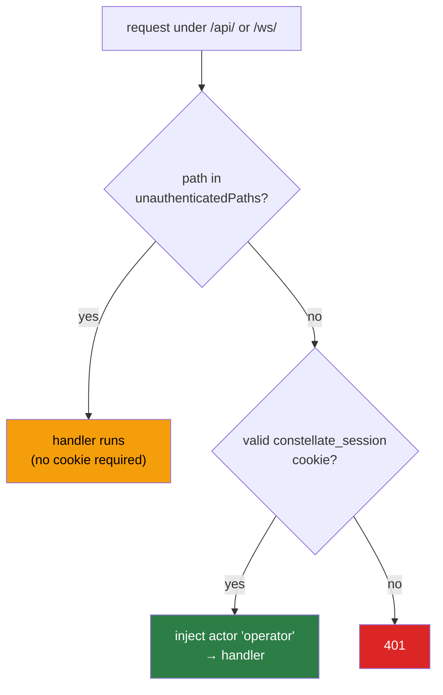
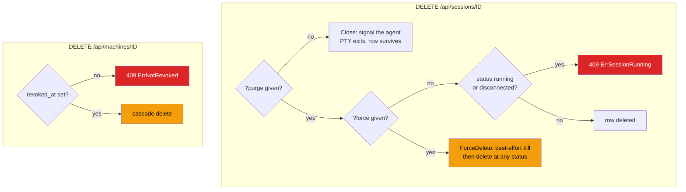
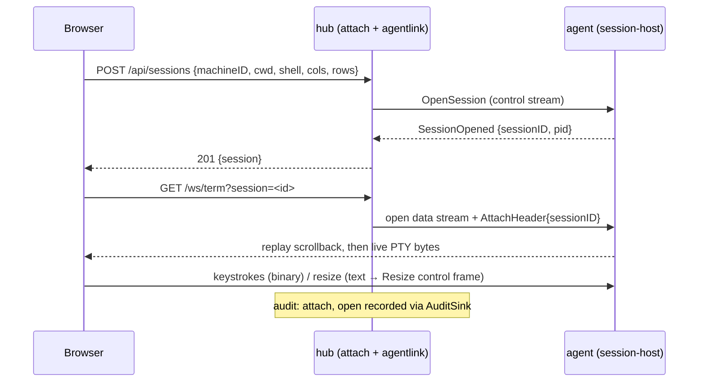

# 06 · API reference

All routing is wired in `internal/hub/adapter/primary/httpapi/server.go`, behind the chain
`loggingMiddleware(authMiddleware(mux))`. Every path under `/api/` or `/ws/` is **gated by the
operator session cookie** unless it appears in the exact-match allowlist.

---

## Auth gating


```mermaid
flowchart TD
    R["request under /api/ or /ws/"] --> AL{path in<br/>unauthenticatedPaths?}
    AL -->|yes| PASS["handler runs<br/>(no cookie required)"]
    AL -->|no| CK{valid constellate_session<br/>cookie?}
    CK -->|yes| INJ["inject actor 'operator'<br/>→ handler"]
    CK -->|no| E401["401"]

    style PASS fill:#f59e0b,color:#000
    style INJ fill:#2d7d46,color:#fff
    style E401 fill:#dc2626,color:#fff
```

**Allowlist** (`middleware.go:20-29`, exact match):
`/api/enroll`, `/api/auth/totp`, `/api/auth/recovery`, `/api/auth/status`, `/api/auth/logout`,
`/api/auth/webauthn/login/begin`, `/api/auth/webauthn/login/finish`, and `/ws/agent`.

`/ws/agent` bypasses the **cookie** but is **not** unauthenticated — it authenticates via the
machine-signed bearer assertion validated inside the handler
([04 · Wire protocol](04-wire-protocol.md#the-agent-signed-bearer-assertion-internaltransportauthgo)).

---

## REST endpoints

| Method + path | Handler (`httpapi/…`) | Auth | Purpose |
|---------------|-----------------------|------|---------|
| `GET /api/machines` | `machines.go:5` | gated | List machines + live online/metrics overlay |
| `POST /api/machines/{id}/revoke` | `machines.go:20` | gated | **Soft**-revoke: sets `revoked_at`, dial-home starts failing. 204 |
| `POST /api/machines/{id}/unrevoke` | `machines.go:28` | gated | Clear `revoked_at`, re-enabling dial-home. 204 |
| `DELETE /api/machines/{id}` | `machines.go:36` | gated | **Hard** delete — **409** unless the machine is already revoked (`enroll.ErrNotRevoked`). Cascades. 204 |
| `POST /api/sessions` | `sessions.go:38` | gated | Open a PTY session `{machineID, projectID?, cwd, shell, cols, rows, title?}` |
| `GET /api/sessions` | `sessions.go:74` | gated | List all session records |
| `GET /api/machines/{id}/sessions` | `sessions.go:88` | gated | Sessions on one machine |
| `DELETE /api/sessions/{id}` | `sessions.go:104` | gated | Close a session; `?purge` deletes the row (**409** if still live); `?purge&force` kills the PTY and deletes anyway |
| `PATCH /api/sessions/{id}` | `sessions.go:129` | gated | Metadata only: `{title}` and/or `{autoRelaunch}` (no wire change) |
| `GET /api/projects` | `projects.go:27` | gated | List projects |
| `POST /api/projects` | `projects.go:41` | gated | Create `{machineID, name, path, color?}` |
| `DELETE /api/projects/{id}` | `projects.go:74` | gated | Delete — **409** if it still owns sessions |
| `GET /api/dashboard` | `dashboard.go:80` | gated | Fleet-wide aggregated `View` — shape below |
| `POST /api/enroll` | `enroll.go:34` | **allowlisted** | Bootstrap enrollment; protected only by the one-time token |
| `GET /api/auth/status` | `auth.go:52` | **allowlisted** | Does an operator exist / is this session authed? |
| `POST /api/auth/totp` | `auth.go:72` | **allowlisted** | Operator login via TOTP `{code}` |
| `POST /api/auth/recovery` | `auth.go:92` | **allowlisted** | Operator login via a single-use recovery code |
| `POST /api/auth/logout` | `auth.go:133` | **allowlisted** | Delete session + clear cookie |
| `POST /api/auth/webauthn/login/begin` | `auth.go:165` | **allowlisted** | Start passkey login ceremony |
| `POST /api/auth/webauthn/login/finish` | `auth.go:177` | **allowlisted** | Finish passkey login, set cookie |
| `POST /api/auth/webauthn/register/begin` | `auth.go:193` | gated | Start passkey registration (needs an active session) |
| `POST /api/auth/webauthn/register/finish` | `auth.go:205` | gated | Finish passkey registration |

> ### ⚠️ Drift: `DESIGN.md` §9 abbreviates the auth routes
> `DESIGN.md` lists `POST /api/auth/webauthn/begin|finish` and only `POST /api/auth/totp`. The real
> WebAuthn paths are nested under `/login/` and `/register/` (`auth.go:165-205`), and there are also
> `/api/auth/recovery`, `/api/auth/status`, `/api/auth/logout`, plus `DELETE /api/sessions/{id}`,
> `PATCH /api/sessions/{id}`, and `GET /api/dashboard` that §9 omits. Code is authoritative.

### Two deletes, two guards, opposite polarity

The two destructive endpoints both refuse by default — but the precondition runs the *other way
round*, which is worth internalizing before you reach for either.


```mermaid
flowchart TD
    subgraph S["DELETE /api/sessions/ID"]
        S1{"?purge given?"} -->|no| SC["Close: signal the agent<br/>PTY exits, row survives"]
        S1 -->|yes| S2{"?force given?"}
        S2 -->|no| S3{"status running<br/>or disconnected?"}
        S3 -->|yes| SE["409 ErrSessionRunning"]
        S3 -->|no| SD["row deleted"]
        S2 -->|yes| SF["ForceDelete: best-effort kill<br/>then delete at any status"]
    end
    subgraph M["DELETE /api/machines/ID"]
        M1{"revoked_at set?"} -->|no| ME["409 ErrNotRevoked"]
        M1 -->|yes| MD["cascade delete"]
    end

    style SE fill:#dc2626,color:#fff
    style ME fill:#dc2626,color:#fff
    style SF fill:#f59e0b,color:#000
    style MD fill:#f59e0b,color:#000
```

A session refuses deletion **while it is alive**; a machine refuses deletion **until you have
revoked it**. The machine rule makes revoke a mandatory speed bump in front of an irreversible,
cascading operation — you cannot fat-finger a whole machine's history away in one request. Note
that `disconnected` counts as alive for the session guard (`sessions/usecase.go`): the control link
is down, but the PTY is presumed to still be running, so a plain `?purge` will not silently discard
a session you can still get back.

**The machine cascade** runs as one SQLite transaction in
`adapter/secondary/sqlite/machine_store.go` — `sessions` → `projects` → `machine_credentials` →
`machines`. It is **application-level, not `ON DELETE CASCADE`**: no FK in the schema carries a
cascade clause ([05 · Data model](05-data-model.md)). Audited as `machine_delete`.

---

## `GET /api/dashboard` — the response shape

One request composes every read port the dashboard needs, so the frontend polls exactly one endpoint
while the view is active (`app/dashboard/usecase.go`, DTOs in `httpapi/dashboard.go:15-79`):

```json
{
  "totals": {
    "machinesOnline": 2, "machinesTotal": 3,
    "sessionsRunning": 5, "sessionsExited": 11, "sessionsLost": 1,
    "sessionsDisconnected": 2, "sessionsTotal": 19, "projectsTotal": 4,
    "sessionsActive": 1, "sessionsIdle": 3, "sessionsAwaitingInput": 1
  },
  "machines":       [{"id":"…","name":"…","os":"linux","online":true,"revoked":false,
                      "lastSeenAt":1750000000,"running":3,"total":8}],
  "projects":       [{"id":"…","name":"…","machineID":"…",
                      "running":2,"exited":4,"lost":0,"disconnected":1,"total":7}],
  "attentionItems": [{"kind":"lost_session","machineID":"…","sessionID":"…","label":"…"}],
  "recentAudit":    [{"ts":1750000000,"actor":"operator","action":"attach",
                      "machineID":"…","sessionID":"…","detail":""}]
}
```

`attentionItems[].kind` is a closed set of three (`app/dashboard/usecase.go:57-59`):

| `kind` | Level | Fires when |
|--------|-------|-----------|
| `lost_session` | session | A session's session-host died under it — the PTY is gone |
| `disconnected_sessions` | machine | An **offline** machine still owns `disconnected` sessions — the PTYs are probably fine, the machine just isn't calling home |
| `awaiting_input` | session | Activity detection says a shell is blocked on a prompt ([03 · Agent & sessions](03-agent-and-sessions.md)) |

`recentAudit` is capped at the **20 most recent** rows. `projects` includes the synthetic
"Ungrouped" bucket for project-less sessions.

---

## WebSocket endpoints

| Path | Handler | Auth | Role |
|------|---------|------|------|
| `GET /ws/term?session={id\|new}` | `wsbrowser/terminal.go:38` | gated (cookie) | Browser ↔ PTY relay. Binary frames = terminal I/O; text frames: `{"type":"resize"}` browser→hub, `{"type":"hb","ts":…}` hub→browser keepalive (15 s). Close codes: 4404 not found, 4410 session ended, 4503 agent offline |
| `GET /ws/overview` | `wsbrowser/overview.go:32` | gated (cookie) | Server-push snapshot fan-out for the tile grid |
| `GET /ws/agent` | `wsagent/endpoint.go:59` | **bearer assertion** | Agent dial-home; yamux control stream. Not browser-facing |

**Static / SPA:** any path not under `/api` or `/ws` falls through to `spaHandler`, serving the
embedded React app (`web.Dist()`). Auth gating is decided by prefix — `needsAuth :=
strings.HasPrefix(path, "/api/") || strings.HasPrefix(path, "/ws/")` (`middleware.go:47`) — so
**everything static is ungated by construction**, not by allowlist entry. That is what lets the PWA
work: `/manifest.webmanifest`, `/sw.js`, `/icons/*`, and the favicons must be fetchable by the
browser and by the service worker before any session cookie exists.

> ### ⚠️ Two MIME types are registered by hand
> `server.go`'s `init()` calls `mime.AddExtensionType` for **`.webmanifest`** →
> `application/manifest+json` and **`.ico`** → `image/x-icon`. Go's built-in table lacks both, and a
> manifest served with a sniffed content-type is **rejected outright by browsers** — the app silently
> stops being installable. If you add a static asset with an exotic extension, check this list first.

---

## Error model (`httpapi/errors.go`)

Domain errors map to HTTP status in one place. Responses are `{"error":{"code":"…"}}`; the frontend
branches on `code`, not on the message string.

The whole mapping is one `statusFor(err)` function (`errors.go:37-93`) — a flat `errors.Is` chain
that falls through to **500**. Anything not listed here is a 500 by construction, which is the point:
a new domain error is invisible to the HTTP layer until someone deliberately maps it.

| Domain error | Status | Notable consumers |
|--------------|--------|-------------------|
| `machine.ErrNotFound`, `session.ErrNotFound`, `project.ErrNotFound` | 404 | REST + `/ws/term` |
| `enroll.ErrUnknownMachine` | 404 | machine revoke / unrevoke / delete |
| `project.ErrInvalid` | 400 | `POST /api/projects` |
| `project.ErrDuplicatePath` | 409 | `POST /api/projects` (unique `(machine_id, path)`) |
| `projects.ErrHasSessions` | 409 | `DELETE /api/projects/{id}` — never orphans or cascades |
| `sessions.ErrSessionRunning` | 409 | `DELETE /api/sessions/{id}?purge` on a live (`running` **or** `disconnected`) session |
| `enroll.ErrNotRevoked` | 409 | `DELETE /api/machines/{id}` — revoke first |
| `enroll.ErrRevoked` | 403 | dial-home for a revoked machine |
| `enroll.ErrInvalidToken` | 401 | `POST /api/enroll` (expired / already used) |
| `auth.ErrInvalidCredential`, `auth.ErrChallengeNotFound` | 401 | TOTP · recovery · passkey login |
| `auth.ErrNoOperator` | 403 | any auth route before `hub operator add` has run |
| `auth.ErrWebAuthnUnavailable` | **501** | passkey routes when WebAuthn is not configured |
| `agentlink.ErrAgentOffline` | 503 | opening a session on a machine that is not dialed in |
| `agentlink.AgentError{Code:"cwd_not_found"}` | **422** | `POST /api/sessions` — recoverable: the UI offers to create the dir and retry |
| rate-limit exceeded | 429 + `Retry-After` | `POST /api/auth/totp`, `/api/auth/recovery` |

---

## Request lifecycle: opening a terminal


```mermaid
sequenceDiagram
    participant BR as Browser
    participant HUB as hub (attach + agentlink)
    participant AG as agent (session-host)
    BR->>HUB: POST /api/sessions {machineID, cwd, shell, cols, rows}
    HUB->>AG: OpenSession (control stream)
    AG-->>HUB: SessionOpened {sessionID, pid}
    HUB-->>BR: 201 {session}
    BR->>HUB: GET /ws/term?session=<id>
    HUB->>AG: open data stream + AttachHeader{sessionID}
    AG-->>BR: replay scrollback, then live PTY bytes
    BR->>AG: keystrokes (binary) / resize (text → Resize control frame)
    Note over HUB: audit: attach, open recorded via AuditSink
```

---

## Where to go next

- The messages behind these routes: [04 · Wire protocol](04-wire-protocol.md)
- The rows these endpoints read/write: [05 · Data model](05-data-model.md)
- How the browser calls them: [07 · Frontend](07-frontend.md)
- Auth internals (TOTP steps, cookie flags, rate limits): [09 · Security](09-security.md)
