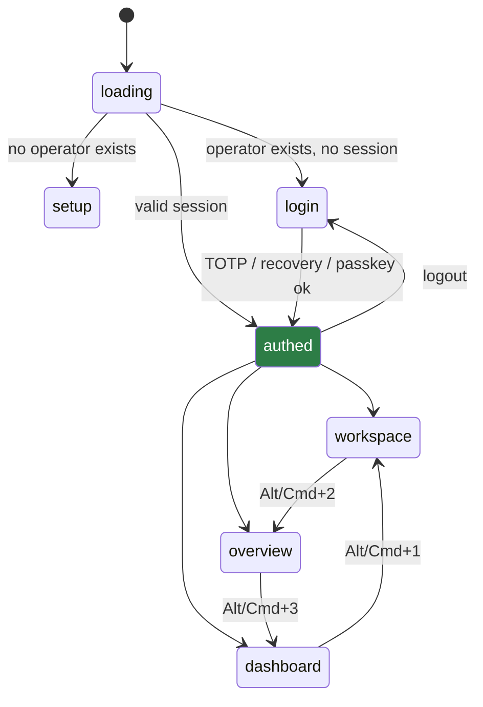
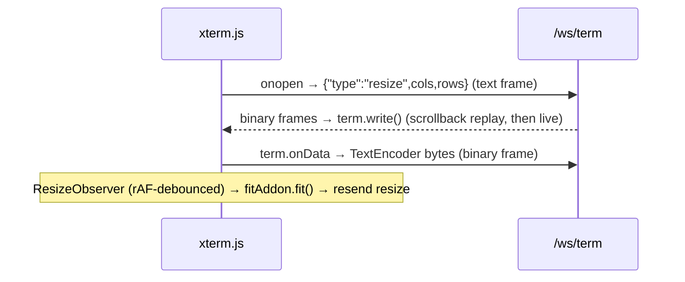

# 07 · Frontend

A **React 18 + xterm.js 5** single-page app, built with **Vite 6** and **embedded into the hub
binary** — `web/embed.go` does `//go:embed all:dist` over `web/dist`, and the hub serves it as static
assets (`web/dist` is gitignored except `.gitkeep`). No separate frontend server in production.

Build: `make web` → `npm ci && npm run build` (`tsc && vite build`). The hub Docker image builds it in
a `node:22` stage.

> ### ⚠️ Drift: the real stack is leaner than `DESIGN.md` §13 claims
> | `DESIGN.md` §13 says | The code (`web/package.json`) actually uses |
> |---|---|
> | zustand **+ TanStack Query** | zustand only — server state is a manual 2 s `setInterval` (`App.tsx:157-171`) |
> | **React Router** | none — routing is `window.location.hash` (`store/index.ts:58-67`) |
> | **Tailwind CSS** | none — plain CSS in `web/src/styles.css` |
> | `addon-fit` **+ addon-webgl** | `@xterm/addon-fit` only |
> | (not mentioned) | `@dnd-kit/core` for pane drag-and-drop |
> The `DESIGN.md` §12 tree (`web/api/`, `web/features/`, `web/store/`, `types/api.ts`) matches the
> real layout in shape; the dependency list in §13 does not.

State is one zustand store (`web/src/store/index.ts`); the store, plus `web/src/api/*` (REST + WS
clients) and `web/src/features/*` (overview, terminal, sidebar, dashboard, auth, activity), are the map.

---

## Three views + an auth gate



`ViewMode = 'workspace' | 'overview' | 'dashboard'` (`store/index.ts:51`). `setViewMode` writes
`window.location.hash`, and an `App.tsx` `hashchange` listener reads it back — the **URL hash is the
source of truth**, so browser back/forward and manual hash edits work without a router. View-switch
shortcuts use physical `KeyboardEvent.code` (`Digit1/2/3`) so they survive non-US layouts.

**Polling is view-gated** (`App.tsx:157-171`): one 2 s interval calls `refreshDashboard()` only while
the Dashboard is active, otherwise `refreshMachines/refreshProjects/refreshSessions`. Terminal and
overview data are **push** (WebSocket), not polled.

---

## Workspace — the recursive split-pane

The workspace is an **n-ary split tree** (`web/src/features/terminal/paneTree.ts`):

```ts
type PaneNode = LeafPane | SplitPane
interface LeafPane  { kind: 'leaf';  id; sessionId: string | null }
interface SplitPane { kind: 'split'; id; direction: 'horizontal' | 'vertical'; children: PaneNode[] }
```

Same-direction splits **flatten** — three horizontal splits give one 33/33/33 group, not nested
50/25/25. `WorkspaceNode` (`Workspace.tsx`) renders leaves as `<TerminalPane>` and splits as
`react-resizable-panels` groups; it subscribes to a **boolean** `focusedPaneId === node.id` (not the
whole id) and is `memo`-wrapped, so focusing a pane doesn't re-render every terminal. On a narrow
viewport (`max-width:600px`) only the focused leaf renders full-screen.

Pane operations are pure tree transforms: `splitPane`, `closePane` (last pane resets to one empty
leaf), `detachPane` (nulls `sessionId`, keeps the leaf; the session stays alive in the sidebar),
`assignSession`/`splitPaneWithSession` (drag-and-drop, single-occupancy — a session binds to one leaf
at a time). `paneRoot`/`focusedPaneId` persist to `localStorage` with a structural validator.

**A sidebar click never clobbers a live pane** — `assignSessionFromSidebar` refuses if any pane holds
a *running* terminal; only an explicit drag (`@dnd-kit/core`, drop zones center/top/bottom/left/right)
reassigns live panes.

| Shortcut (Workspace only, capture-phase so xterm can't swallow it) | Action |
|---|---|
| `Shift+Alt+-` | split focused pane horizontal |
| `Shift+Alt+=` | split focused pane vertical |
| `Shift+Alt+W` | close focused pane |
| `Shift+Alt+E` | detach session from focused pane |
| `Shift+Alt+R` | reload focused pane (fresh socket + scrollback replay) |

Full keybinding reference: [`hub.shortcut.md`](hub.shortcut.md).

---

## Terminal component

`useTerminal.ts` wires xterm.js to `wss://<host>/ws/term?session=<id>` (`binaryType:'arraybuffer'`):



- Scrollback replay needs no special handling — the agent replays the ring as ordinary PTY bytes, so
  they are just the first bytes written after connect.
- **Clipboard**: `Ctrl+Shift+C` copies the selection, `Ctrl+Shift+V` pastes — both `preventDefault`
  so xterm doesn't double-handle. Plain `Ctrl+C`/`Ctrl+V` are untouched (SIGINT still works). Needs a
  secure context (HTTPS), which the hub serves.
- **Live pwd**: `Session.pwd` (refreshed each 2 s poll) renders as a `.pane-title-dir` chip in the
  header, truncated to the last 8 chars behind `…` (`/home/amm/dev/Constellate` → `…stellate`), full
  path on hover. Distinct from the fixed spawn `cwd` — see [05 · Data model](05-data-model.md).
- Bumping `reloadKey` (the reload button / `Shift+Alt+R`) tears down and reattaches the socket.

---

## Overview — the color-tile grid

`OverviewGrid` subscribes to `useSnapshots()`, which holds a `Map<sessionID, Snapshot>` fed by
`wss://<host>/ws/overview` (JSON text frames, 2 s reconnect backoff with a "Reconnecting to live
view…" banner). Each `SessionTile` renders `Snapshot.lines[].runs[]` as `<span>` runs inside a
`<pre>` — **not** an xterm instance per tile (that wouldn't scale to a full grid). `runStyle()` decodes
the packed color ints and attr bitmask (`palette.ts`) into inline CSS. A running tile is a
`role="button"`; click / Enter / Space calls `diveToSession` → switches to Workspace and loads that
session into the focused pane. Tiles show an `<ActivityBadge>` (active / idle / **needs input**). The
pipeline behind these tiles is [08 · Overview pipeline](08-overview-pipeline.md).

---

## Dashboard

`DashboardView` renders the `GET /api/dashboard` aggregate (`Dashboard` type, `types.ts:42-98`):

- **Summary cards** — machines online/total, sessions running/total with an active/idle/needs-input
  breakdown, a dedicated "Awaiting input" card (warn if > 0), "Lost sessions" (danger if > 0),
  "Projects".
- **Attention** — `AttentionItem[]` of kind `lost_session` / `offline_with_running` /
  `awaiting_input`; "✓ All clear" when empty.
- **Machines** table (name, os, status dot, running/total, last-seen; revoked rows tagged) and
  **Projects** rollups (running/exited/lost chips, "Ungrouped" last).
- **Activity feed** — the 20 most recent audit events via `ACTION_LABELS`.

A stale poll shows a "Reconnecting… showing last known data" banner while still rendering the last good
snapshot.

---

## Auth UI

`Login.tsx` drives TOTP (a segmented 6-box `OtpInput` with auto-advance/paste/auto-submit → `POST
/api/auth/totp`), recovery codes (`POST /api/auth/recovery`), and — when `window.PublicKeyCredential`
exists — passkey login via the WebAuthn `navigator.credentials.get()` dance against
`/api/auth/webauthn/login/{begin,finish}`. When authed you can "Add passkey"
(`/api/auth/webauthn/register/{begin,finish}`); errors are mapped (`NotAllowedError` → "cancelled",
`InvalidStateError` → "already registered") and surfaced through a `Snackbar`. `ApiError` carries the
HTTP status and structured `code` so UI branches on codes, not strings.

---

## Core types (`web/src/types.ts`)

`Machine` (+ optional `cpuPercent`/`memUsedMB`/`memTotalMB` → the `12% · 5.4/16 GB` sidebar line),
`Project`, `Session` (`status`, `activity`, `cwd`, `pwd?`, `autoRelaunch`), the `Dashboard` family,
and the overview wire shape `Snapshot`/`SnapLine`/`SnapRun{t,f?,b?,a?}` — a mirror of the hub DTOs and
`transport.Snapshot` ([04 · Wire protocol](04-wire-protocol.md)). The store also holds UI-only state:
`sidebarOpen`, `showRevokedMachines`, and a `collapsed: Set` for sidebar group collapse — all
persisted to `localStorage`.

---

## Where to go next

- The endpoints these clients call: [06 · API reference](06-api-reference.md)
- The snapshot stream feeding the overview: [08 · Overview pipeline](08-overview-pipeline.md)
- All keyboard shortcuts: [`hub.shortcut.md`](hub.shortcut.md)
