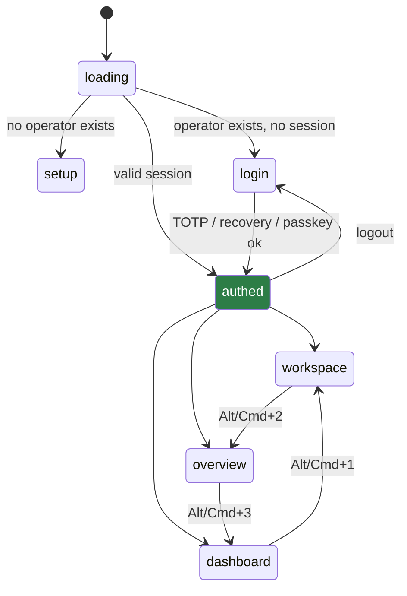
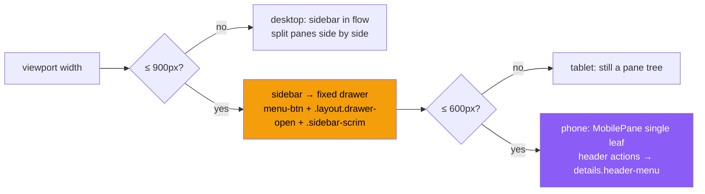
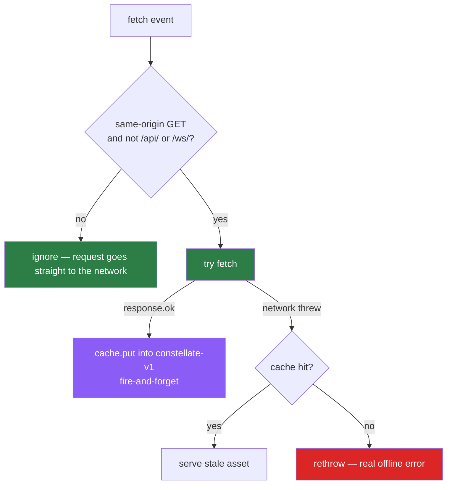
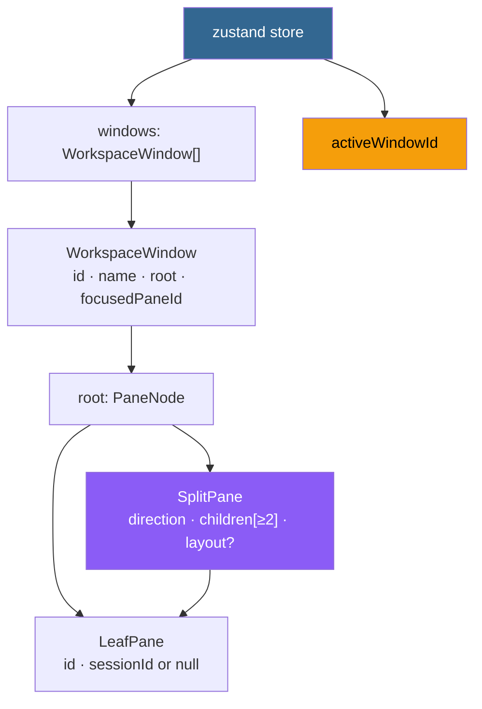
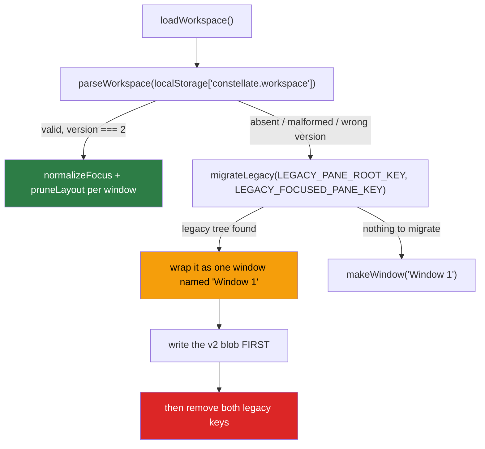
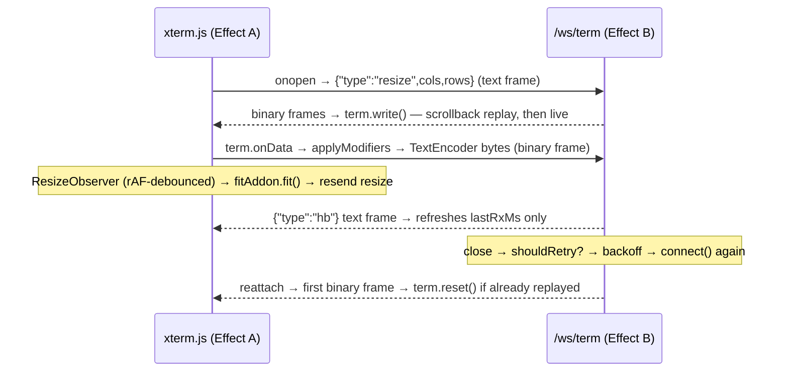
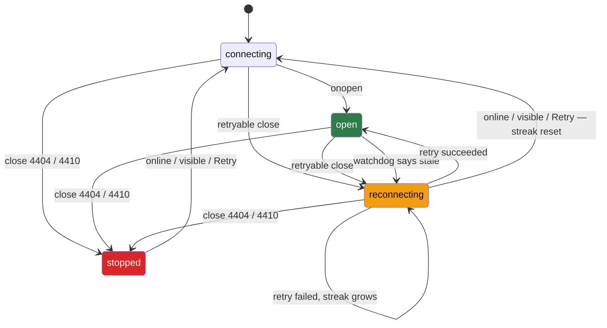
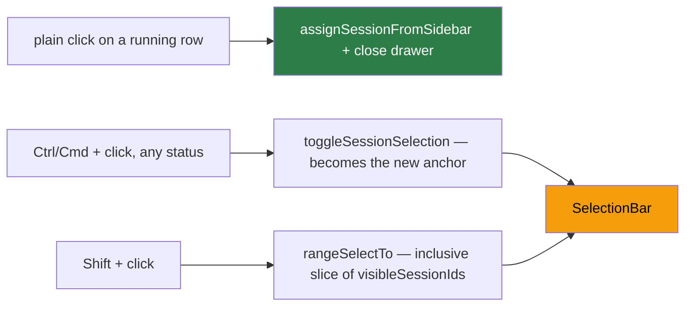

# 07 · Frontend

A **React 18 + xterm.js 5** single-page app, built with **Vite 6** and **embedded into the hub
binary** — `web/embed.go` does `//go:embed all:dist` over `web/dist`, and the hub serves it as static
assets (`web/dist` is gitignored except `.gitkeep`). No separate frontend server in production.

Build: `make web` → `npm ci && npm run build` (`tsc && vite build`). The hub Docker image builds it in
a `node:22` stage. Unit tests are `vitest` (`npm run test:run`); the `*.test.ts` files sit next to the
pure modules they cover (`paneTree`, `windowList`, `reconnect`, `keys`, `touchScroll`, `order`,
`sessionSettings`, `collapse`, `inputMode`, `keypadLayout`, `dnd`, `paneActions`).

> ### ⚠️ Drift: the real stack is leaner than `DESIGN.md` §13 claims
> | `DESIGN.md` §13 says | The code (`web/package.json`) actually uses |
> |---|---|
> | zustand **+ TanStack Query** | zustand only — server state is a manual 2 s `setInterval` in `App.tsx` |
> | **React Router** | none — routing is `window.location.hash` (`hashToView` in `store/index.ts`) |
> | **Tailwind CSS** | none — plain CSS in `web/src/styles.css` |
> | `addon-fit` **+ addon-webgl** | `@xterm/addon-fit` only |
> | (not mentioned) | `@dnd-kit/core` (drag-and-drop), `react-resizable-panels` (splits), `@fontsource/ibm-plex-*` (self-hosted fonts, no Google Fonts call) |
> The `DESIGN.md` §12 tree (`web/api/`, `web/features/`, `web/store/`, `types/api.ts`) matches the
> real layout in shape; the dependency list in §13 does not.

State is one zustand store (`web/src/store/index.ts`); the store, plus `web/src/api/*` (REST + WS +
reconnect policy), `web/src/breakpoints.ts` (responsive contract) and `web/src/features/*` (overview,
terminal, sidebar, dashboard, auth, activity), are the map.

---

## Component tree

```
App
├─ header.app-header — menu-btn (hamburger, workspace only) · app-wordmark · view-toggle
│                      · "Add passkey" / "Sign out" · details.header-menu (phone overflow)
├─ Snackbar
└─ viewMode
   ├─ 'overview'  → div.overview-shell > OverviewGrid > SessionTile[]
   ├─ 'dashboard' → DashboardView
   └─ 'workspace' → DndContext
      ├─ div.workspace-shell
      │  ├─ div.layout(.drawer-open)
      │  │  ├─ div.sidebar-scrim   (click-outside close, ≤900px only)
      │  │  ├─ ProjectTree          → MachineGroup > ProjectSection > SessionRow
      │  │  │                          + SelectionBar + SessionSettingsModal
      │  │  └─ TerminalView (= Workspace)
      │  │     └─ div.workspace-stack → one .workspace-window per WorkspaceWindow
      │  │        └─ isNarrow ? MobilePane : WindowRoot → WorkspaceNode tree
      │  │           (leaf → TerminalPane → useTerminal + Keypad; split → Group/Panel/Separator)
      │  └─ WindowTabs              (bottom tab strip)
      └─ DragOverlay > div.drag-chip
```

`Login` renders **instead of** all of the above whenever `authState !== 'authed'`.
`TerminalView` is a two-line re-export module (`features/terminal/TerminalView.tsx` →
`export { Workspace as TerminalView }`), so the render entry point for the pane tree is `Workspace`,
not `WorkspaceNode`.

---

## Three views + an auth gate


```mermaid
stateDiagram-v2
    [*] --> loading
    loading --> setup: no operator exists
    loading --> login: operator exists, no session
    loading --> authed: valid session
    login --> authed: TOTP / recovery / passkey ok
    authed --> workspace
    authed --> overview
    authed --> dashboard
    workspace --> overview: Alt/Cmd+2
    overview --> dashboard: Alt/Cmd+3
    dashboard --> workspace: Alt/Cmd+1
    authed --> login: logout

    style authed fill:#2d7d46,color:#fff
```

`ViewMode = 'workspace' | 'overview' | 'dashboard'` (`store/index.ts`). `setViewMode` writes
`window.location.hash`, and an `App.tsx` `hashchange` listener reads it back — the **URL hash is the
source of truth**, so browser back/forward and manual hash edits work without a router. Both writers
guard against the self-write feedback loop by comparing `hashToView(window.location.hash)` with the
target before assigning. View-switch shortcuts use physical `KeyboardEvent.code` (`Digit1/2/3`) so
they survive non-US layouts.

**Polling is view-gated**: one 2 s `setInterval` in `App.tsx` calls `refreshDashboard()` only while
the Dashboard is active, otherwise `refreshMachines` / `refreshProjects` / `refreshSessions`. Terminal
and overview data are **push** (WebSocket), not polled.

---

## Responsive contract — `web/src/breakpoints.ts`

One module owns every viewport width that reshapes the UI, plus the hooks that read them.

| Export | Value | What it gates |
|---|---|---|
| `PHONE_MAX` | `600` | single-leaf `MobilePane`, compact header, header overflow menu |
| `TABLET_MAX` | `900` | sidebar becomes an off-canvas drawer + hamburger |
| `phoneQuery` | `(max-width: 600px)` | `useIsNarrow()` in `Workspace.tsx` |
| `tabletQuery` | `(max-width: 900px)` | available to JS; the drawer itself is pure CSS |
| `coarseQuery` | `(pointer: coarse)` | keypad, touch grid sizing, `useVisualViewport` |
| `useMediaQuery(q)` | hook | SSR-safe initializer, re-syncs and subscribes to `change` |
| `useCoarsePointer()` | hook | `useMediaQuery(coarseQuery)` |
| `confirmTimeoutMs()` | `8000` coarse / `4000` otherwise | auto-cancel for every inline destructive confirm |


```mermaid
graph LR
    W["viewport width"] --> T{"≤ 900px?"}
    T -- no --> D["desktop: sidebar in flow<br/>split panes side by side"]
    T -- yes --> DR["sidebar → fixed drawer<br/>menu-btn + .layout.drawer-open + .sidebar-scrim"]
    DR --> P{"≤ 600px?"}
    P -- no --> TB["tablet: still a pane tree"]
    P -- yes --> PH["phone: MobilePane single leaf<br/>header actions → details.header-menu"]

    style DR fill:#f59e0b,color:#000
    style PH fill:#8b5cf6,color:#fff
```

The phone header collapse is **CSS-decided, not JS-decided**: `App.tsx` always renders both the inline
`Add passkey` / `Sign out` buttons and the `<details className="header-menu">` overflow, and the
`@media` blocks choose which one is visible. No width measurement in React means no layout thrash.

> ### ⚠️ CSS-sync footgun: the breakpoints are hand-duplicated
> `breakpoints.ts` carries an explicit **CSS-SYNC CONTRACT** comment: there is no build-time bridge
> from these TS constants into CSS, so `600` and `900` are literally re-typed in `styles.css`
> `@media (max-width: …px)` blocks (both carry `Keep the max-width in sync with PHONE_MAX/TABLET_MAX
> in web/src/breakpoints.ts` comments). Change one side and the JS-chosen `MobilePane` will disagree
> with the CSS-chosen layout — a class of bug that renders as "the phone layout is half applied".
> Change both, always.

---

## PWA installability

The app installs to a phone home screen and runs standalone.

| Piece | Where | Notes |
|---|---|---|
| Manifest | `web/public/manifest.webmanifest` | `display: "standalone"`, `start_url`/`scope` `/`, `theme_color` `#100d09`, `background_color` `#0c0b08` |
| Icons | `web/public/icons/icon-{192,512}.png`, `maskable-{192,512}.png` | `purpose: "any"` and `"maskable"` pairs; sources `web/public/icon.svg`, `maskable.svg` |
| Head tags | `web/index.html` | `<link rel="manifest">`, `theme-color`, `favicon.svg` + `favicon.ico`, `apple-touch-icon.png`, `mobile-web-app-capable`, `apple-mobile-web-app-{capable,status-bar-style,title}` |
| Viewport | `web/index.html` | `viewport-fit=cover` (draw under the notch) + `interactive-widget=resizes-content` (Android shrinks the layout viewport for the soft keyboard) |
| Registration | `web/src/main.tsx` | `navigator.serviceWorker.register('/sw.js')` on `window`'s `load`, errors swallowed |
| Safe areas | `web/src/styles.css` | `env(safe-area-inset-*)` on the header (`--header-h: calc(40px + env(safe-area-inset-top, 0px))`), the window-tab strip, the drawer sidebar and the modal overlay |

### The service worker is deliberately network-first with **no precache**


```mermaid
graph TD
    F["fetch event"] --> C{"same-origin GET<br/>and not /api/ or /ws/?"}
    C -- no --> PASS["ignore — request goes straight to the network"]
    C -- yes --> NET["try fetch"]
    NET -- "response.ok" --> PUT["cache.put into constellate-v1<br/>fire-and-forget"]
    NET -- "network threw" --> HIT{"cache hit?"}
    HIT -- yes --> SERVE["serve stale asset"]
    HIT -- no --> RETHROW["rethrow — real offline error"]

    style PASS fill:#2d7d46,color:#fff
    style NET fill:#2d7d46,color:#fff
    style PUT fill:#8b5cf6,color:#fff
    style RETHROW fill:#dc2626,color:#fff
```

`web/public/sw.js` states the rationale in its header: Constellate is a **live control plane**, and a
stale cached shell could silently hide real fleet state — so an online user must always get the
network response. The cache (`CACHE_NAME = 'constellate-v1'`) is a last-resort offline fallback for
static assets already fetched successfully this session, nothing more. `isCacheable()` hard-refuses
non-GET, cross-origin, `/api/*` and `/ws/*` — terminal I/O and REST never pass through the worker.
`install` calls `skipWaiting()`; `activate` deletes **every** cache whose name is not `CACHE_NAME`
and then `clients.claim()`, so bumping that string is the whole cache-eviction mechanism.

---

## Workspace — windows of split panes

The workspace is a list of **windows**, each owning its own **n-ary split tree** and its own focus.


```mermaid
graph TD
    S["zustand store"] --> WS["windows: WorkspaceWindow[]"]
    S --> AW["activeWindowId"]
    WS --> W1["WorkspaceWindow<br/>id · name · root · focusedPaneId"]
    W1 --> R["root: PaneNode"]
    R --> SP["SplitPane<br/>direction · children[≥2] · layout?"]
    R --> LF["LeafPane<br/>id · sessionId or null"]
    SP --> LF

    style S fill:#336791,color:#fff
    style AW fill:#f59e0b,color:#000
    style SP fill:#8b5cf6,color:#fff
```

```ts
// features/terminal/paneTree.ts
type PaneNode = LeafPane | SplitPane
interface LeafPane  { kind: 'leaf';  id; sessionId: string | null }
interface SplitPane { kind: 'split'; id; direction: 'horizontal' | 'vertical'
                      children: PaneNode[]; layout?: Record<string, number> }

// features/terminal/windowList.ts
interface WorkspaceWindow { id; name; root: PaneNode; focusedPaneId: string }
```

Same-direction splits **flatten** — three horizontal splits give one 33/33/33 group, not nested
50/25/25. `WorkspaceNode` (`Workspace.tsx`) renders leaves as `<TerminalPane>` and splits as
`react-resizable-panels` `Group`/`Panel`/`Separator`; it subscribes to a **boolean**
(`windows.find(…)?.focusedPaneId === node.id`, not the whole id) and is `memo`-wrapped, so focusing a
pane doesn't re-render every terminal.

**Every window stays mounted.** `Workspace` renders one `.workspace-window` div per window and hides
the inactive ones with `visibility: hidden` over a full-size box — *not* `display: none`, because a
zero-size container makes xterm's `FitAddon` compute 0 cols/rows and push that bogus geometry to the
real PTY on the agent. Keeping the box laid out means every terminal's `ResizeObserver` keeps
reporting its true size, sockets stay open, and switching windows is instant with **no scrollback
replay**.

### Pure tree ops vs. pure window ops

`paneTree.ts` never knows about windows; `windowList.ts` never re-implements tree logic. It lifts
paneTree's operations onto one window inside an immutable array.

| `paneTree.ts` | `windowList.ts` |
|---|---|
| `makeLeaf`, `splitPane`, `closePane`, `detachPane` | `makeWindow`, `defaultWindowName` (reuses the lowest free `Window N`) |
| `assignSession`, `clearSession`, `splitPaneWithSession` | `findWindow`, `findWindowByPane`, `findWindowBySession` |
| `setSplitLayout`, `pruneLayout` | `updateWindow`, `updateWindowByPane` |
| `findLeaf`, `findLeafBySession`, `firstLeafId`, `firstEmptyLeafId` | `clearSessionEverywhere`, `collectWindowPaneIds` |
| `collectSessionIds`, `orderedLeafIds` | `addWindow`, `removeWindow`, `renameWindow`, `reorderWindow`, `normalizeFocus` |

The one invariant that lives in `windowList.ts` rather than `paneTree.ts`: **a session is bound to at
most one pane across the whole workspace**, not merely within one tree. `clearSessionEverywhere` is
what enforces it, and every assign path runs it first — so dropping a session into window B *moves*
it out of window A instead of opening a second attach.

Store actions resolve the owning window from the bare `paneId` (`findWindowByPane`), so a keyboard
shortcut or a drag never has to say which window it meant, and acting on a pane always brings its
window to the front. `activeWindowOf(state)` resolves `activeWindowId` with a fallback to
`windows[0]`, so a drifted id can never render a blank workspace.

`closeWindow` unbinds panes only: the shells keep running on the agent and stay reachable from the
sidebar — the same semantics as `detachPane`, which is why the ✕ needs no confirmation. Closing the
**last** window resets it to one fresh empty window, mirroring `closePane` on the final leaf.

**A sidebar click never clobbers a live pane** — `assignSessionFromSidebar` refuses if any pane *in
the active window* holds a *running* terminal. The gate is deliberately scoped to the active window:
were it global, a single live terminal in a background window would disable sidebar clicks outright.
Only an explicit drag (`@dnd-kit/core`, drop zones center/top/bottom/left/right) reassigns live panes.

### Persisted split sizes

`SplitPane.layout` maps **child pane id → size** (react-resizable-panels v4's `Layout` shape), keyed
by id rather than index so it survives child reordering. `Group` gets it as `defaultLayout`, and
`onLayoutChanged` calls the store's `setSplitLayout(splitId, layout)` → `treeSetSplitLayout`, which
returns the *same root reference* when `splitId` names nothing, so untouched windows keep identity.

`pruneLayout` (run on every restore) drops any `layout` whose key set no longer matches its current
children. That is what makes stored sizes self-correcting after add/close/detach — the tree-mutation
functions carry **no** layout bookkeeping of their own.

The field is **optional and additive**, which is exactly why it did *not* bump `WORKSPACE_VERSION`:
old blobs without `layout` still validate, and new blobs stay readable by prior builds. Bumping would
have made `isWorkspaceState` reject every existing user's saved windows.

### Persistence and the one-time v1 → v2 migration


```mermaid
graph TD
    L["loadWorkspace()"] --> P["parseWorkspace(localStorage['constellate.workspace'])"]
    P -- "valid, version === 2" --> OK["normalizeFocus + pruneLayout per window"]
    P -- "absent / malformed / wrong version" --> M["migrateLegacy(LEGACY_PANE_ROOT_KEY, LEGACY_FOCUSED_PANE_KEY)"]
    M -- "legacy tree found" --> W1["wrap it as one window named 'Window 1'"]
    W1 --> WRITE["write the v2 blob FIRST"]
    WRITE --> DEL["then remove both legacy keys"]
    M -- "nothing to migrate" --> FRESH["makeWindow('Window 1')"]

    style OK fill:#2d7d46,color:#fff
    style W1 fill:#f59e0b,color:#000
    style DEL fill:#dc2626,color:#fff
```

- `WORKSPACE_KEY = 'constellate.workspace'` holds `{ version, activeWindowId, windows }` at
  `WORKSPACE_VERSION = 2`.
- `LEGACY_PANE_ROOT_KEY = 'constellate.paneRoot'` and `LEGACY_FOCUSED_PANE_KEY =
  'constellate.focusedPaneId'` are the pre-multi-window keys. They are read **once** at startup and
  deleted after the v2 blob is safely written — so an interrupted migration retries on the next load
  rather than losing the layout.
- `isWorkspaceState` validates shape, a non-empty window list, and an `activeWindowId` naming a real
  window. A `focusedPaneId` pointing at a dead pane is **not** grounds for rejection: that is
  repairable (`normalizeFocus`), and discarding a user's whole layout over it would be a bad trade.
- Writes go through a `useStore.subscribe` diff-writer that serializes and compares against the last
  written JSON, so the 2 s session poll doesn't thrash `localStorage`.
- `refreshSessions` reconciles bindings against the server: a pane bound to a session the hub no
  longer knows about is cleared back to an empty leaf. Sessions that still exist — including
  `exited`/`lost` — stay bound.

### Window tabs

`WindowTabs.tsx` renders the bottom strip: one `role="tab"` per window with a roving `tabIndex`,
`+` to add, double-click (or `F2`) to rename in place, `✕` to close when `closable` (i.e.
`windows.length > 1`), `ArrowLeft`/`ArrowRight` to walk the strip as a **ring**. `windowNeedsInput()`
scans the sessions bound in that window's tree for `activity === 'awaiting-input'` and shows a compact
`<ActivityBadge>` — that is the reason the strip earns its space: a background window that stopped to
ask a question announces itself without being opened.

Colors come from `windowColor.ts`: `WINDOW_PALETTE` is 20 hand-ordered hex colors, `windowColor(ordinal)`
is keyed to the window's **1-based tab position** and wraps every 20, and `fgFor()` picks `#1a1a1a`
or `#ffffff` from perceived luminance (`0.299r + 0.587g + 0.114b`, threshold `140`). The same
`ordinal` colors the tab dot and the sidebar row's window badge, so "which window is this shell in?"
is answerable at a glance from either end.

### Shortcuts

All of these are **Workspace-only**, use physical `e.code`, and listen in the **capture phase** with
`preventDefault` + `stopPropagation` so xterm can't swallow them. They self-suppress while a dialog
is open (`document.querySelector('[aria-modal="true"]')`) — capture phase means the modal's own
`stopPropagation` cannot block them, so the check has to live in the handler.

| Shortcut | `e.code` | Action |
|---|---|---|
| `Shift+Alt+-` | `Minus` | split focused pane horizontal |
| `Shift+Alt+=` | `Equal` | split focused pane vertical |
| `Shift+Alt+W` | `KeyW` | close focused pane |
| `Shift+Alt+E` | `KeyE` | detach session from focused pane |
| `Shift+Alt+R` | `KeyR` | reload focused pane — fresh socket + scrollback replay |
| `Shift+Alt+←` | `ArrowLeft` | move focus to the pane left of the focused one; no-op at the edge |
| `Shift+Alt+→` | `ArrowRight` | move focus to the pane right of the focused one; no-op at the edge |
| `Shift+Alt+↑` | `ArrowUp` | move focus to the pane above the focused one; no-op at the edge |
| `Shift+Alt+↓` | `ArrowDown` | move focus to the pane below the focused one; no-op at the edge |
| `Shift+Alt+T` | `KeyT` | `addWindow()` — new window, activated |
| `Shift+Alt+PageUp` | `PageUp` | previous window, ring-wraps |
| `Shift+Alt+PageDown` | `PageDown` | next window, ring-wraps |

Window stepping is a no-op with fewer than two windows. Arrow moves resolve through
`movePaneFocus()` in `paneTree.ts` — a purely structural climb to the nearest ancestor splitting along
the requested axis, no rects — and `TerminalPane` mirrors the resulting store focus into the DOM on
each `false → true` transition of its `focused` prop. Full keybinding reference:
[`hub.shortcut.md`](hub.shortcut.md).

---

## Terminal component

`useTerminal.ts` wires xterm.js to `wss://<host>/ws/term?session=<id>` (`binaryType:'arraybuffer'`).
It is split into **two effects on purpose**:

- **Effect A — terminal lifecycle.** Owns the xterm instance, `FitAddon`, the custom key handler, the
  touch-scroll bridge and the `ResizeObserver`. It captures **no socket** — anything that sends reads
  `wsRef.current` — so a reconnect can swap the socket underneath a terminal that keeps its scrollback.
- **Effect B — connection.** Owns the WebSocket and the reconnect state machine (next section). It
  runs after Effect A in the same commit, so `termRef` holds the fresh terminal when the first socket
  opens.


```mermaid
sequenceDiagram
    participant XT as xterm.js (Effect A)
    participant WS as /ws/term (Effect B)
    XT->>WS: onopen → {"type":"resize",cols,rows} (text frame)
    WS-->>XT: binary frames → term.write() — scrollback replay, then live
    XT->>WS: term.onData → applyModifiers → TextEncoder bytes (binary frame)
    Note over XT: ResizeObserver (rAF-debounced) → fitAddon.fit() → resend resize
    WS-->>XT: {"type":"hb"} text frame → refreshes lastRxMs only
    Note over WS: close → shouldRetry? → backoff → connect() again
    WS-->>XT: reattach → first binary frame → term.reset() if already replayed
```

- **Clipboard**: `Ctrl+Shift+C` copies the selection, `Ctrl+Shift+V` pastes — both `preventDefault`
  and return `false` from `attachCustomKeyEventHandler` so xterm doesn't double-handle. Plain
  `Ctrl+C`/`Ctrl+V` are untouched (SIGINT still works). Needs a secure context (HTTPS), which the hub
  serves.
- **Font size**: `constellate.fontSize` in `localStorage`, clamped to `[8, 32]`, default `14`;
  changing it refits and resends the resize.
- **Live pwd**: `Session.pwd` (refreshed each 2 s poll) renders as a `.pane-title-dir` chip in the
  pane header, truncated to the last 8 chars behind `…` (`/home/amm/dev/Constellate` → `…stellate`),
  full path on hover, and dropped entirely at ≤600px where it would starve the title. Distinct from
  the fixed spawn `cwd` — see [05 · Data model](05-data-model.md).
- Bumping `reloadKey` (the pane's `↻` button / `Shift+Alt+R`, stored per pane in `paneReloads`) tears
  down and reattaches both effects.

---

## Terminal auto-reconnect

A network blip used to kill a pane's socket **silently** — no badge, keystrokes dropped into the
void, while the status dot still read "running" because that reflects *backend* session state. Panes
now self-heal. Policy lives in `web/src/api/reconnect.ts`, a deliberately **pure, DOM-free** module
(its one browser-touching helper, `subscribeWake`, guards for a missing `window`) so the timing rules
are unit-testable under vitest's node environment.

| Constant | Value | Why |
|---|---|---|
| `BACKOFF_BASE_MS` | `300` | first retry is a blink, not a stall |
| `BACKOFF_CAP_MS` | `15_000` | a long outage still retries ~4×/minute |
| `BACKOFF_JITTER` | `0.2` | ±20 % spread so panes that died together don't retry together |
| `STABLE_AFTER_MS` | `3_000` | a connection that lived this long resets the streak |
| `STALE_AFTER_MS` | `45_000` | no bytes and no `hb` for this long ⇒ zombie socket |
| `WATCHDOG_TICK_MS` | `10_000` | how often staleness is checked |
| `WAKE_STAGGER_MS` | `300` | 0–300 ms random delay on a wake-triggered retry |

`backoffDelay(attempt, rand)` = `min(300 × 2^attempt, 15_000)` × `1 ± 0.2·rand`, with `rand` injected
so tests are deterministic. `shouldRetry(code)` is false for exactly two codes: **4404** (session not
found) and **4410** (session ended).


```mermaid
stateDiagram-v2
    [*] --> connecting
    connecting --> open: onopen
    connecting --> reconnecting: retryable close
    connecting --> stopped: close 4404 / 4410
    open --> reconnecting: retryable close
    open --> reconnecting: watchdog says stale
    open --> stopped: close 4404 / 4410
    reconnecting --> reconnecting: retry failed, streak grows
    reconnecting --> open: retry succeeded
    reconnecting --> stopped: close 4404 / 4410
    reconnecting --> connecting: online / visible / Retry — streak reset
    stopped --> connecting: online / visible / Retry

    style open fill:#2d7d46,color:#fff
    style reconnecting fill:#f59e0b,color:#000
    style stopped fill:#dc2626,color:#fff
```

Why it is shaped this way (`DESIGN.md` §18, *Post-M7 — resilient terminal sockets*):

- **Retries are indefinite.** A hub restart or an overnight laptop sleep must heal on its own; a
  counter that gives up after a handful of attempts strands every pane at "Disconnected" long before
  the outage ends. `'stopped'` is therefore reached **only** on a terminal close code — never by
  attempt count — and it still offers a **Retry** button.
- **Stability resets the streak.** `isStable(openedAt, closedAt)` is true at ≥ 3 s; a close after a
  stable run opens a *new* outage at attempt 1, so the first retry is a ~300 ms blink rather than a
  resumption of some earlier outage's 15 s backoff. (`scheduleReconnect` passes `unstableStreak - 1`
  as the exponent, so attempt 1 waits exactly `BACKOFF_BASE_MS`.)
- **The staleness watchdog arms at socket open**, not on the first heartbeat: waiting for one leaves a
  blind window on every connect, and a socket that black-holes immediately would never arm it at all.
  On firing it calls `closeActive()` + `scheduleReconnect()` **directly** rather than `ws.close()` —
  a black-holed socket may never deliver `onclose`, which would leave the pane stuck at `'open'`: no
  badge, keystrokes silently dropped, and the wake handler declining to retry.
- **Wake signals retry immediately.** `subscribeWake` fires on `online` and on `visibilitychange` →
  visible (mobile browsers freeze timers in background tabs, so the backoff timer may have slept
  through the whole outage), from `'reconnecting'` *and* `'stopped'`, after a 0–300 ms per-pane
  stagger that avoids a scrollback-replay stampede against the hub.
- **Replay dedupe.** The agent replays its whole scrollback ring on **every** attach. Into a fresh
  terminal that is right; into one that already took a replay it would double the screen. So on the
  **first binary frame** of an attach into an already-replayed xterm the client calls `term.reset()`
  — not `clear()`, since modes and the alt screen must go too — deferred to the first frame to avoid
  a blank flash. The flag is `replayedRef`, tracked at **hook** level, because Effect B remounts
  whenever the `enabled` gate flips (session goes `lost`, then `running` again) while Effect A's
  terminal — still holding the pre-blip screen — survives. A per-effect counter would call the next
  attach "the first one" and append the replay to what is already on screen.
- **Keystrokes are not buffered while disconnected.** Replaying a stale `rm …` minutes later is worse
  than dropping it, and the badge makes the drop visible.
- **The gate that matters:** the socket is enabled only for `running` sessions — `TerminalPane` passes
  `enabled = sessionId != null && !sessionEnded`. An exited/lost PTY can never be re-attached, so
  retrying it forever would just hammer the hub. When `enabled` is false the hook parks at the shared
  `CONN_IDLE` object (`{ status: 'connecting', attempt: 0 }`) so React state doesn't churn.

The pane surfaces this as `.pane-reconnecting` (`role="status"`, `aria-live="polite"`):
`Reconnecting… · attempt N` while retrying, `Disconnected` + a **Retry** button when stopped. The
session-ended overlay takes precedence, so two badges never stack on one pane.

---

## Touch input

Four modules make a terminal usable under a thumb. Three of them are pure and unit-tested; only the
keypad is a component.

| Module | Shape | Job |
|---|---|---|
| `keys.ts` | pure, no React/DOM | logical key → raw PTY bytes: `controlByte`, `applyCtrl`, `applyAlt`, `applyModifiers`, `specialKeySeq(key, appCursor)` |
| `touchScroll.ts` | pure core + DOM wiring | swipe → synthetic wheel events |
| `useVisualViewport.ts` | hook, coarse-pointer only | keeps the shell above the soft keyboard |
| `Keypad.tsx` + `keypadLayout.ts` | component + pure data | the on-screen keyboard |

**`keys.ts`** is the shared vocabulary between the on-screen controls and the wire. `specialKeySeq`
knows that F1–F4 are SS3 (`ESC O P/Q/R/S`) in *both* cursor modes while F5–F12 are CSI `~`
sequences with the xterm gaps at 16 and 22, and that cursor/Home/End switch between CSI (`ESC [`) and
SS3 (`ESC O`) with `applicationCursorKeysMode`. `applyModifiers` folds Ctrl **then** Alt, so
`Ctrl+Alt+x` is `ESC` followed by the control byte. With no modifier armed it is the identity, so the
normal typing path stays byte-identical to a plain passthrough.

**`touchScroll.ts`** exists because xterm's native touch handling is *dead* in exactly the cases that
matter on a phone: the alternate screen (vim/less/htop — no scrollback to scroll) and any app with
mouse tracking on (xterm ignores touch entirely). Its **wheel** pipeline, however, routes every mode
correctly. So `shouldIntercept(term)` snapshots those two conditions at `touchstart`, and an
intercepted vertical drag is translated into one `WheelEvent` per line
(`deltaMode: DOM_DELTA_LINE`) dispatched at `term.element`. `accumulateLines` carries a sub-cell
residual so fractional movement accumulates without drift. Guard rails: `VERTICAL_SLOP_PX = 8` keeps a
tap eligible to become the compat click that focuses the terminal, `HORIZONTAL_SLOP_PX = 12` yields a
dominant horizontal swipe back to the platform (OS back-gesture), and listeners run in the **capture**
phase so an intercepted swipe can stop propagation before xterm's own bubble-phase handlers.

**`useVisualViewport.ts`** (called once, in `App.tsx`) mirrors `window.visualViewport.height` into the
`--app-height` custom property that `.app-root` sizes against, rAF-debounced, and pins page scroll to
`(0, 0)` so the fixed header can't be panned off-screen. It is inert on fine pointers, and near a
no-op in the default `keypad` mode — there is no system keyboard to open. It stays because two cases
still shrink the visible viewport: `native` input mode, and iOS Safari's collapsing URL bar. iOS never
resizes the *layout* viewport (it pans the page and only `visualViewport` reports the truth), which is
the case this hook exists for; Android Chrome already shrinks the layout viewport thanks to
`interactive-widget=resizes-content`, where writing `--app-height` merely matches it.

### The keypad replaces the native keyboard

**Why.** Typing `.` on Android/GBoard duplicated already-sent characters. The cause is IME
composition inside xterm.js: letters sit in an uncommitted composing region on the helper textarea,
and when punctuation commits the word `CompositionHelper._finalizeComposition` re-sends
`textarea.value.substring(compositionPosition.start)` — bytes it already emitted keystroke by
keystroke (upstream xterm.js **#3191** and **#4152**). Attributes cannot fix it: xterm already sets
`autocorrect`/`autocapitalize`/`spellcheck` off on that textarea itself.

**How.** On coarse-pointer devices the app suppresses the system keyboard outright
(`inputMode.ts` → `InputMode = 'keypad' | 'native'`, `DEFAULT_INPUT_MODE = 'keypad'`, persisted per
device under `INPUT_MODE_KEY = 'constellate.inputMode'`). `imeAttrsFor()` returns the attributes plus
a `readOnly` flag; `useTerminal`'s `applyImeAttrs` performs the single DOM write (re-applied after
`term.open()` so it survives a `reloadKey` reattach, and bouncing focus when the mode changes on an
already-focused textarea, since `inputmode` alone does not re-negotiate the virtual keyboard):

| Written to `.xterm-helper-textarea` | Effect |
|---|---|
| `inputmode="none"` | Chrome/Android + iOS Safari never raise the virtual keyboard |
| `readOnly = true` | suppresses `input`/composition events — **not** `keydown`/`keypress` |

That last row is why hardware keyboards on tablets keep typing (xterm's real key path is `keydown`)
and why paste keeps working (`navigator.clipboard.readText()` → `term.paste()`, not an input event).
The decision is made in `TerminalPane` — `term.setInputMode(coarsePointer ? inputMode : 'native')` —
rather than inside `Keypad`, because `Keypad` mounts only on coarse pointers *and* only while the pane
is focused; leaving it there would strand a desktop terminal with whatever the hook defaulted to and
silently break CJK input on a laptop.

**The keypad.** `Keypad.tsx` renders an always-visible **command row** (Esc, Tab, Ctrl, Alt, arrows,
Fn, ⌨) above one of three **layers** — `letters`, `symbols`, `fn`. The layout is *pure data* in
`keypadLayout.ts` (no React, no DOM): each key is an `id` + labels + one `KeypadAction` variant, so
the renderer is generic and adding a key is a layout edit only. Presses emit on `pointerdown`
(`useKeyPress.ts`) with long-press auto-repeat (`AUTO_REPEAT_DELAY_MS = 400`, then every
`AUTO_REPEAT_INTERVAL_MS = 60`). Shift is a three-state latch — `off` → `once` → `lock` (a second tap
within `SHIFT_LOCK_WINDOW_MS = 400` caps-locks).

> #### ⚠️ `LAYER_ROWS` — every layer must have exactly 4 rows
> This is load-bearing, not cosmetic. The keypad sits in a flex column beneath a `flex:1` terminal
> body, so **keypad height → terminal height**:
>
> ```mermaid
> flowchart LR
>     T["taller/shorter keypad"] --> RO[pane ResizeObserver]
>     RO --> F["fitAddon.fit()"]
>     F --> WS["{'type':'resize'} → hub → agent"]
>     WS --> PTY["real PTY resize<br/>every running TUI reflows"]
> ```
>
> A **layer** switch must never do that — reaching for a `.` may not reflow the user's `vim`. Two
> things legitimately do: a **mode** toggle (keypad ↔ native), since native mode drops the bottom
> row, and a **collapse** to the handle bar, which hides every row on purpose — both are the user
> explicitly trading keypad for terminal. Guarded by a unit test on the layout and end-to-end by
> `keypad: a layer switch must not resize the PTY` (`test/e2e/browser/responsive.spec.ts`, which
> reads `stty size` either side of the switch) plus its inverse, `keypad: collapsing to the handle
> gives the PTY its rows back`.

**Native mode.** The ⌨ key toggles back to the system keyboard for voice input, emoji and non-Latin
IMEs; the choice persists per device. Its attributes are best-effort hardening only — **the
composition bug can still duplicate characters there**. That is exactly why `keypad` is the default.

---

## Sidebar

`ProjectTree.tsx` renders machines → projects → sessions, with an "Ungrouped" bucket after each
machine's projects. Collapse state is a `Set<string>` of `machine:<id>` / `project:<id>` /
`ungrouped:<machineID>` keys (`collapse.ts`), persisted under `COLLAPSED_KEY = 'constellate.collapsed'`.

### Rows

A session row is two lines. The main line is `status` badge · label · `<ActivityBadge>` · a gear
button opening the settings modal. The meta line (running sessions only) carries the **window-position
color badge** — `windowColor(ordinal)` where `ordinal` is the 1-based index of the window whose tree
currently binds this session (`findWindowBySession`) — and the live `pwd`. The row's `aria-label`
spells out all of it: status, activity (`awaiting-input` reads as "needs input"), window number,
directory, and the drag affordance.

### Multi-select


```mermaid
graph LR
    C["plain click on a running row"] --> A["assignSessionFromSidebar + close drawer"]
    M["Ctrl/Cmd + click, any status"] --> T["toggleSessionSelection — becomes the new anchor"]
    S["Shift + click"] --> R["rangeSelectTo — inclusive slice of visibleSessionIds"]
    T --> BAR["SelectionBar"]
    R --> BAR

    style A fill:#2d7d46,color:#fff
    style BAR fill:#f59e0b,color:#000
```

`features/sidebar/order.ts` exports `visibleSessionIds(state)`: the ids of every session **currently
rendered**, in exact top-to-bottom DOM order. It must mirror `ProjectTree`'s traversal precisely
(visible machines → each non-collapsed machine's projects in order → then its ungrouped sessions),
because that order is what Shift-click range selection walks — a collapsed machine, project or
ungrouped section contributes nothing, since its rows are not in the DOM.

`SelectionBar.tsx` is the floating bulk-action bar at the bottom of the sidebar, shown while
`selectedSessionIds.size > 0`. Its single destructive action removes all selected sessions via
`Promise.allSettled`; succeeded ids are already dropped from the selection by `removeSession`, so only
the **failures stay selected** for a retry, under a `role="alert"` message.

### Destructive actions

| Action | Store | Behaviour |
|---|---|---|
| Remove session | `removeSession(id)` | force-purge (`DELETE /api/sessions/{id}?purge=1&force=1`) if `running`, plain delete if closed; optimistically drops the row, unbinds it from every pane, and clears it from the selection |
| Close session | `closeSession(id)` | optimistically flips the row to `exited` — refetching here would race the agent's heartbeat and often read a stale `running` |
| Revoke / un-revoke machine | `revokeMachine` / `unrevokeMachine` | optimistic flag flip, reverted on failure |
| Delete machine | `deleteMachine(id)` | server first, **then** local prune mirroring the cascade (machine + its sessions + its projects) and `clearSessionEverywhere` for each; a 409 renders "Revoke the machine first." |
| Delete project | `deleteProject(id)` | a 409 (`projects.ErrHasSessions`) renders "Project still has sessions — move or close them first." |

Every one of these is a two-step **inline confirm** that auto-disarms after `confirmTimeoutMs()` —
4 s with a mouse, 8 s on a coarse pointer.

---

## Session settings modal

`components/Modal.tsx` is the reusable dialog primitive, and it does the accessibility work properly:

- `createPortal` to `<body>` — it must escape the sidebar's overflow/transform stacking context,
  since the sidebar is a fixed, `translateX`-ed drawer at ≤900px.
- `role="dialog"` + `aria-modal="true"` + `aria-labelledby` wired to a `useId()`-generated heading id.
- A Tab/Shift+Tab focus trap over a `FOCUSABLE` selector list, plus **structural** background
  isolation: the app root gets `inert` while open (the portal lives outside it, so the dialog stays
  interactive). `inert` is lifted *before* focus is restored, because an inert ancestor rejects focus.
- Focus restore that survives the previously-focused element being unmounted — it falls back to
  `[data-modal-fallback-focus]` (the Workspace view-toggle button) rather than dropping to `<body>`.
- Escape and backdrop-`mousedown` close; the backdrop only closes when the press **started** on the
  overlay, so a drag begun inside the card and released outside doesn't dismiss it. Body scroll is
  locked and restored.
- Its `stopPropagation` is best-effort only: App's `Shift+Alt` pane shortcuts listen in the capture
  phase on `window` and instead self-suppress while any `[aria-modal="true"]` exists.

`SessionSettingsModal.tsx` renders for the session named by the store's `settingsSessionId`
(`openSessionSettings` / `closeSessionSettings`), keyed by session id so drafts reset between rows. It
auto-closes if the session disappears while open, and clears itself on unmount so a hashchange away
from the workspace can't silently reopen it.

Saving is atomic and diff-based. `sessionSettings.ts` is the pure part:

```ts
computeSaveOps(baseline: SessionSettingsBaseline, draft) -> { ok: true, ops } | { ok: false, error }
```

The `baseline` is snapshotted **at mount**, not read live — so a value changed by another client while
the dialog is open is not silently reverted; the ops reflect only what *this* user edited. An
emptied name is a blocking validation error; an unchanged name is left out entirely. The result goes
out as one `patchSession(id, { title?, autoRelaunch? })` request — both fields commit together, so
there is no half-applied state — followed by a refetch. Layout is frozen at mount-time
`running`-ness while `liveRunning` gates editability, so a session that exits mid-edit shows
"Session is no longer running" instead of the form disappearing under the cursor.

---

## Overview — the color-tile grid

`OverviewGrid` subscribes to `useSnapshots()`, which holds a `Map<sessionID, Snapshot>` fed by
`wss://<host>/ws/overview` (JSON text frames, `SocketStatus = 'connecting' | 'open' | 'reconnecting'`,
with a "Reconnecting to live view…" banner). It reuses the **same** `api/reconnect.ts` policy as the
terminal panes — `backoffDelay` + `subscribeWake` rather than a flat retry, so a hub restart isn't
hammered at a fixed interval — but has **no** `stopped` state and no wake stagger: the overview is
ambient (a stale grid is harmless, and there is only one socket), so it just keeps trying until it is
correct again. Each `SessionTile` renders `Snapshot.lines[].runs[]` as `<span>` runs inside a
`<pre>` — **not** an xterm instance per tile (that wouldn't scale to a full grid). `runStyle()` decodes
the packed color ints and attr bitmask (`palette.ts`) into inline CSS. A running tile is a
`role="button"`; click / Enter / Space calls `diveToSession` → switches to Workspace and, if the
session is already bound somewhere, activates *that* window and focuses its pane; otherwise it loads
into the focused pane of the active window. Split layouts are preserved either way. Tiles show an
`<ActivityBadge>` (active / idle / **needs input**). The pipeline behind these tiles is
[08 · Overview pipeline](08-overview-pipeline.md).

---

## Dashboard

`DashboardView` renders the `GET /api/dashboard` aggregate (the `Dashboard` family in
`web/src/types.ts`):

- **Summary cards** — machines online/total, sessions running/total with an active/idle/needs-input
  breakdown, a dedicated "Awaiting input" card (warn if > 0), "Lost sessions" (danger if > 0),
  "Projects".
- **Attention** — `AttentionItem[]` of kind `lost_session` / `offline_with_running` /
  `awaiting_input`; "✓ All clear" when empty.
- **Machines** table (name, os, status dot, running/total, last-seen; revoked rows tagged) and
  **Projects** rollups (running/exited/lost chips, "Ungrouped" last).
- **Activity feed** — the 20 most recent audit events via `ACTION_LABELS`.

A stale poll shows a "Reconnecting… showing last known data" banner while still rendering the last good
snapshot.

---

## Auth UI

`Login.tsx` drives TOTP (a segmented 6-box `OtpInput` with auto-advance/paste/auto-submit → `POST
/api/auth/totp`), recovery codes (`POST /api/auth/recovery`), and — when `window.PublicKeyCredential`
exists — passkey login via the WebAuthn `navigator.credentials.get()` dance against
`/api/auth/webauthn/login/{begin,finish}`. When authed you can "Add passkey"
(`/api/auth/webauthn/register/{begin,finish}`); errors are mapped (`NotAllowedError` → "cancelled",
`InvalidStateError` → "already registered") and surfaced through a `Snackbar`. `ApiError` carries the
HTTP status and structured `code` so UI branches on codes, not strings.

---

## Core types and what actually persists

`web/src/types.ts` mirrors the hub DTOs: `Machine` (+ optional `cpuPercent`/`memUsedMB`/`memTotalMB` →
the `12% · 5.4/16 GB` sidebar line), `Project`, `Session` (`status`, `activity`, `cwd`, `pwd?`,
`autoRelaunch`), the `Dashboard` family (`DashboardTotals`, `MachineRollup`, `ProjectRollup`,
`AttentionItem`, `AuditEntry`), and the overview wire shape `Snapshot`/`SnapLine`/`SnapRun{t,f?,b?,a?}`
— a mirror of `transport.Snapshot` ([04 · Wire protocol](04-wire-protocol.md)).

Client state divides sharply into what survives a reload and what does not:

| `localStorage` key | Constant | Holds |
|---|---|---|
| `constellate.workspace` | `WORKSPACE_KEY` | `{ version: 2, activeWindowId, windows }` — the whole multi-window layout |
| `constellate.collapsed` | `COLLAPSED_KEY` | sidebar collapse `Set` |
| `constellate.inputMode` | `INPUT_MODE_KEY` | `keypad` \| `native`, per device |
| `constellate.showRevokedMachines` | *(literal)* | `"true"` / `"false"` |
| `constellate.fontSize` | `FONT_SIZE_KEY` | terminal font px, clamped `[8, 32]` |
| `constellate.paneRoot`, `constellate.focusedPaneId` | `LEGACY_PANE_ROOT_KEY`, `LEGACY_FOCUSED_PANE_KEY` | **legacy** — read once for the v1→v2 migration, then removed |

**Not persisted** (deliberately session-scoped): `sidebarOpen`, `settingsSessionId`,
`selectedSessionIds`, `selectionAnchorId`, `paneReloads`, `machines`/`projects`/`sessions`/`dashboard`
(server state, re-polled). `viewMode` is persisted, but in the **URL hash**, not `localStorage`.

Every `localStorage` touch goes through the `lsGet`/`lsSet`/`lsRemove` helpers, which swallow
exceptions — private mode and storage-disabled browsers degrade to "nothing is remembered" rather
than a white screen.

---

## Where to go next

- The endpoints these clients call: [06 · API reference](06-api-reference.md)
- The snapshot stream feeding the overview: [08 · Overview pipeline](08-overview-pipeline.md)
- What `pwd`, `activity` and `autoRelaunch` mean server-side: [05 · Data model](05-data-model.md)
- Close codes `4404` / `4410` / `4503` and the `hb` frame: [04 · Wire protocol](04-wire-protocol.md)
- Browser E2E specs (`reconnect.spec.ts`, `agent-blip.spec.ts`, `responsive.spec.ts`): [11 · Testing](11-testing.md)
- All keyboard shortcuts: [`hub.shortcut.md`](hub.shortcut.md)
