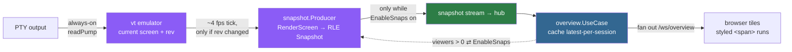
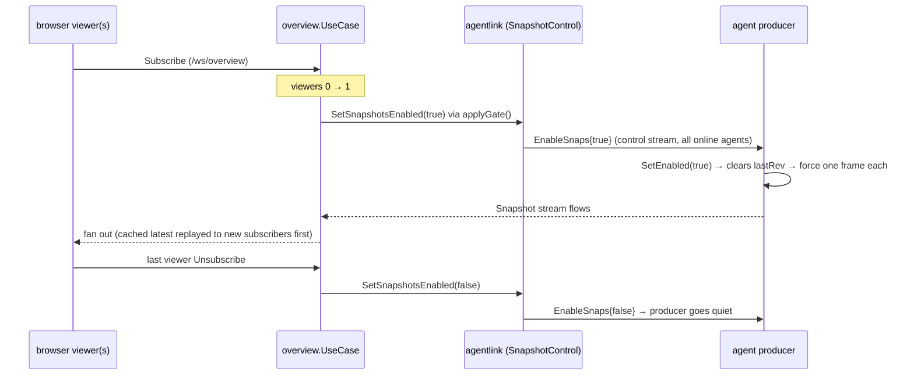

# 08 · The overview pipeline (design rationale)

The **overview** — one page showing every live terminal as a colored tile — is the signature view. It
would be trivial to build badly: attach N terminals and stream N output pipes to the browser. That
does not survive `4 machines × ~10 sessions`. This page is *why the design looks the way it does*.

---

## The problem, stated concretely

Rendering N full live terminals at once means N xterm instances and N raw byte pipes, each as busy as
whatever is running. A single `yes` or `top` saturates the browser. The quality bar
(`DESIGN.md` §2) is: **the overview stays responsive with all machines × ~10 sessions visible, and
bandwidth stays bounded regardless of how busy the shells are.**

So the overview does **not** attach data streams. It ships *screens*, not *output*.

---

## The pipeline

Four independent bandwidth controls stack, and each one alone would help; together they make cost
roughly **constant**:

| Control | Where | Effect |
|---------|-------|--------|
| **Screen, not stream** | agent feeds output into the vt emulator; ships the *grid*, not the bytes | cost is screen-sized (cols×rows), not output-sized |
| **Change-gate** (`rev`) | `snapshot.Producer.runOnce` renders only when `rev` moved | an idle shell sends nothing |
| **Rate-cap** (~4 fps) | `DefaultInterval = 250ms` | a `yes`-flooded screen still sends ≤ 4 frames/s |
| **RLE + viewer-gate** | run-length rows + `EnableSnaps` | colored frames stay small; **zero** bandwidth when nobody watches |

---

## 1 — Always parse, cheaply

The agent's `readPump` (`internal/agent/app/session/manager.go:482-512`) feeds every PTY read into the
session's vt `Screen` **unconditionally** — no dependency on any viewer. This is deliberately cheap and
means the screen is instantly correct the moment a viewer connects; there is no warm-up.

## 2 — Render only on change

`snapshot.Producer.runOnce` (`internal/agent/app/snapshot/producer.go:78-124`) does a two-pass tick
every 250 ms:

1. **Cheap pass** — `RunningScreenRevs()` returns `(sessionID, rev)` pairs with **no rendering**.
2. For each session, render (`RenderScreen`) and send **only if** `rev` differs from the last sent
   value (`lastRev` map). Sessions that didn't change cost a map lookup.

The `rev` counter lives in the emulator (`vt/emulator.go`): `Render()` bumps it only when the grid is
`dirty`. So "did this screen change?" is a `uint64` compare, not a diff.

## 3 — RLE full-color encoding

Each row is run-length encoded: adjacent cells sharing fg/bg/attrs collapse to one `SnapRun`
([04 · Wire protocol](04-wire-protocol.md#the-snapshot-record--rle-full-color-internaltransportsnapshotgo)).
Color is one packed int, attrs one bitmask, and both are omitted when default. A typical terminal
screen is mostly default-styled runs, so even a full-color frame is small.

## 4 — Viewer-gated: zero cost when unwatched

`overview.UseCase.applyGate()` (`internal/hub/app/overview/overview.go:77-92`) calls
`SnapshotControl.SetSnapshotsEnabled` **only when** the desired state (viewers > 0) actually differs
from `lastEnabled`, then broadcasts `EnableSnaps` to every online `Conn`. The agent **always** parses
into the vt emulator (cheap), but only **sends** while enabled — so an overview nobody has open costs
**zero snapshot bytes**. A newly-subscribed browser is first replayed the hub's cached
latest-per-session so every tile populates immediately.

Re-enabling clears the producer's `lastRev` map (`producer.go:52-59`), which force-emits one frame per
session — this single mechanism covers both "a fresh viewer connected" and "the agent reconnected"
without special cases.

---

## Click-to-dive

A tile is a cheap read-only picture; clicking it (`SessionTile` → `diveToSession`) switches to the
Workspace and performs a **normal data-stream attach** ([06 · API reference](06-api-reference.md#request-lifecycle-opening-a-terminal))
— full fidelity, input enabled, scrollback replayed. The overview never carries interactive I/O; it is
purely a low-cost map you dive out of.

---

## Checklist for new work on this pipeline

- Adding a field to `Snapshot`? Make it **omitempty** and additive, and bump `ProtocolVersion`
  ([04 · Wire protocol](04-wire-protocol.md)) — an old peer must ignore it.
- Anything that ships per-output-byte instead of per-screen breaks the "bounded regardless of shell
  busyness" bar. Ship the screen.
- New producer work must stay behind the `EnableSnaps` gate, or you reintroduce cost when nobody is
  watching.
- Keep vt parsing always-on but rendering change-gated — never render on a tick that didn't change
  `rev`.

---

## Where to go next

- The emulator that produces the grid: [03 · Agent & sessions](03-agent-and-sessions.md#the-vt-emulator--an-in-repo-pure-go-terminal)
- The exact snapshot bytes: [04 · Wire protocol](04-wire-protocol.md)
- How tiles render: [07 · Frontend](07-frontend.md#overview--the-color-tile-grid)
