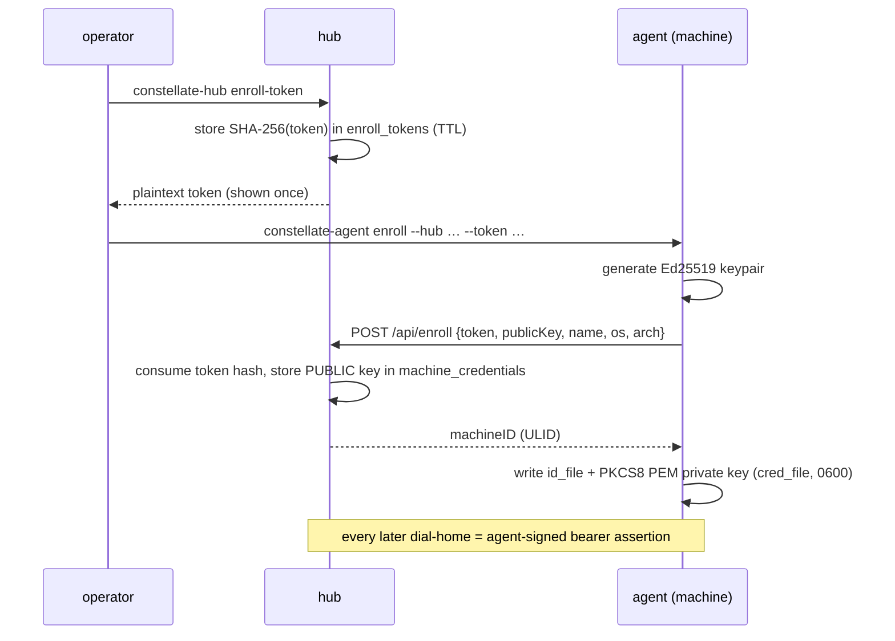
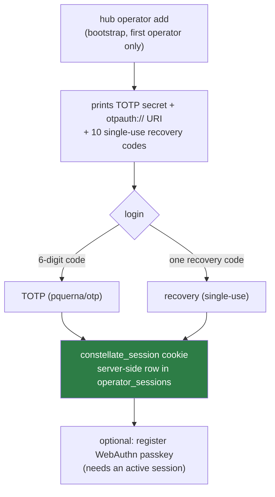

# 09 · Security

The hub is a **remote-code-execution gateway to every enrolled machine**. If it is compromised, the
attacker owns the fleet. Every control below is built around that fact.

**Trust boundaries:**

- Browser ↔ hub — untrusted client → authenticated operator session.
- Hub ↔ agent — mutually authenticated: the agent trusts only its enrolled hub; the hub trusts only
  enrolled, non-revoked machines.
- Agent ↔ shell — full local privilege of the agent's user, by design — it *is* your shell.

Only the hub is public; agents open **no** inbound ports (they dial out).

---

## Agent enrollment — Ed25519, hub holds no secret

- The hub stores **only the public key** (`machine_credentials.public_key BLOB`) and only the
  **SHA-256** of the enrollment token — the plaintext token is shown once and never persisted.
- The token is **single-use and short-lived** (`enroll_token_ttl`, default `15m`); the store's
  `Consume` is atomic.
- Dial-home presents `v1.<machineID>.<unixTs>.<sig>` on `Authorization: Bearer`; the hub verifies with
  `VerifyAgentToken` (±120 s skew) against the stored public key
  ([04 · Wire protocol](04-wire-protocol.md#the-agent-signed-bearer-assertion-internaltransportauthgo)).
  **The hub can never impersonate an agent** — it has no signing key.
- **Revocation is soft**: `constellate-hub revoke <machineID>` sets `machines.revoked_at`;
  `enroll.Authenticate` rejects any machine with a non-NULL `revoked_at` (`ErrRevoked` → 403).
  `constellate-agent reset` wipes the local id/cred.

---

## Operator authentication — TOTP + recovery + passkeys

- **TOTP** (`totp/totp.go`) — 30 s period, 6 digits, SHA-1, ±1 step window, constant-time compare.
  Anti-replay is by **strictly-increasing matched step**: `auth.LoginTOTP` rejects any `step ≤`
  `OperatorStore.LastTOTPStep` and persists the new watermark (`last_used_at`). A code can't be
  replayed even inside its own 30 s window.
- **Recovery codes** — 10 codes, format `xxxxx-xxxxx`, stored only as SHA-256 hashes; `ConsumeRecoveryCode`
  is an atomic single-use.
- **WebAuthn passkeys** (`webauthn/webauthn.go`, `go-webauthn`) — one fixed operator identity
  (`WebAuthnID() = "operator"`). RP-ID/origins resolve in `cmd/hub/main.go`: explicit `webauthn`
  config > derived from `public_url` hostname > localhost dev defaults. Registration requires an
  existing session; ceremony state is round-tripped as opaque JSON through an in-memory
  `ChallengeStore`, keyed by a `constellate_wa_challenge` cookie with a 5-minute TTL.

> A **bare-IP** deployment can't use passkeys — WebAuthn requires a registrable domain or `localhost`,
> so browsers reject a bare IP as the RP-ID. TOTP + recovery still work. See
> [`usage.docker.md`](usage.docker.md).

### The session cookie

`constellate_session` (`httpapi/auth.go:26`): `Path=/`, **HttpOnly**, **SameSite=Lax**, `MaxAge=24h`,
and `Secure` = `strings.HasPrefix(public_url, "https")` (`cmd/hub/main.go:213`). Backed by a
server-side row in `operator_sessions` (opaque random id), validated on every gated request; a second
opaque cookie `constellate_wa_challenge` carries only the transient WebAuthn ceremony key.

---

## Rate limiting (`httpapi/ratelimit.go`)

Fixed-window in-memory counters guard the login endpoints:

| Limiter | Key | Limit |
|---------|-----|-------|
| per-IP | `clientIP(r)` (first hop of `X-Forwarded-For`) | `loginIPMax = 5` / minute |
| global | fixed `"operator-login"` | `loginGlobalMax = 15` / minute |

Both are checked in `handleLoginTOTP` and `handleLoginRecovery`; a denial returns **429** with
`Retry-After`. `clientIP` trusts `X-Forwarded-For`'s first hop — safe **only** because the hub sits
behind a TLS-terminating Caddy and is never directly internet-reachable.

---

## Transport security

- **TLS end to end.** In production, **Caddy** terminates TLS (`deploy/caddy/Caddyfile` +
  `deploy/compose.yaml`) and proxies plain HTTP to the hub on an internal network. Alternatively the
  hub terminates TLS itself via `tls.cert`/`tls.key`. Agents verify the hub cert via `hub_ca` (PEM;
  defaults to system roots) — there is **no** skip-verify escape hatch.
- **Cookie `Secure`** is driven off `public_url` — an `https://` public URL makes the session cookie
  `Secure`, so the hub must be reached over HTTPS in production.

---

## Audit log

Security-relevant actions are written through the `AuditSink` consumer port from the `attach`,
`sessions`, `enroll`, and `auth` use cases — never directly from a handler. Actions:
`login`, `enroll`, `attach`, `open`, `close`, `delete`, `revoke`, `relaunch` (`domain/audit/event.go`).
The dashboard surfaces the 20 most recent. Schema in [05 · Data model](05-data-model.md#the-audit-log).

There is **no dev token** anywhere — it was removed fleet-wide; tests authenticate via real enrollment
(mint + enroll a keypair, dial with a signed token).

---

## Secrets hygiene for this repo

A full sweep of `deploy/`, `configs/`, `install.sh`, `update.sh`, the workflows, and `test/` found
**no real secrets, hostnames, IPs, or domains** — only placeholders (`127.0.0.1`, `0.0.0.0`,
`example.com`, `1.2.3.4`), env-var substitutions (`${CONSTELLATE_DOMAIN}`), and the project's own
public identifiers (`rizquuula/Constellate`, `ghcr.io/rizquuula/constellate-*`). TOTP secrets are
generated at runtime and written to a gitignored path (`deploy/.dev/totp-secret`), never committed.
CI secrets are GitHub Actions `${{ secrets.* }}` references. One non-secret operational note: the
Dockerfiles pin `GOPROXY=https://goproxy.cn,direct`, a China-region module proxy that affects build
reproducibility outside that region — see [10 · Operations](10-operations.md).

---

## Where to go next

- The dial-home token format and verification: [04 · Wire protocol](04-wire-protocol.md)
- Auth routes and their gating: [06 · API reference](06-api-reference.md)
- Operator bootstrap walkthrough: [`usage.binary.md`](usage.binary.md)
