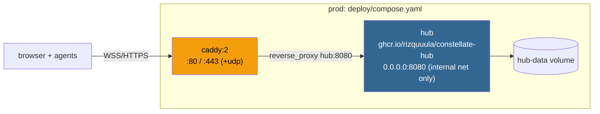
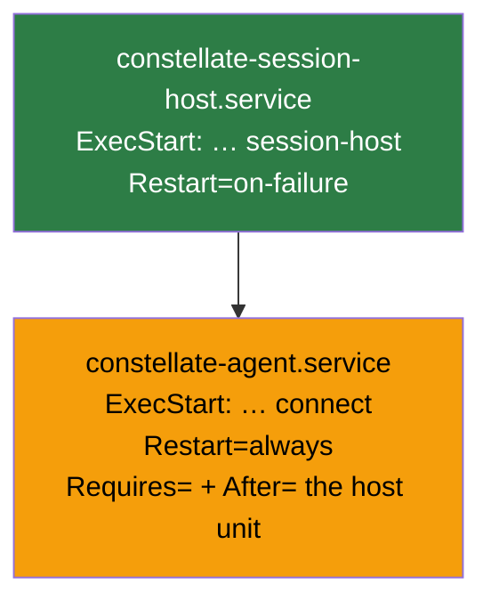

# 10 · Operations

This page is the reference for running Constellate: configuration, the two Docker stacks, the
binary/systemd path, install/update, releases, and a troubleshooting table. For step-by-step
walkthroughs see the task guides: [`usage.binary.md`](usage.binary.md),
[`usage.docker.md`](usage.docker.md), [`usage.agent.md`](usage.agent.md).

---

## Configuration

YAML file via `--config`, with per-field `CONSTELLATE_*` env overrides for containers. Samples in
`configs/`. Defaults below are from `internal/platform/config/{hub,agent}.go`.

### Hub (`internal/platform/config/hub.go`)

| YAML key | Default | Env override |
|----------|---------|--------------|
| `addr` | `127.0.0.1:8080` | `CONSTELLATE_ADDR` |
| `public_url` | `""` | `CONSTELLATE_PUBLIC_URL` |
| `db_path` | `./constellate.db` | `CONSTELLATE_DB_PATH` |
| `enroll_token_ttl` | `15m` | `CONSTELLATE_ENROLL_TOKEN_TTL` |
| `tls.cert` / `tls.key` | `""` / `""` | — |
| `webauthn.rp_id` / `webauthn.origins` | derived from `public_url` | — |
| `log.level` / `log.format` | `info` / `text` | — |

`public_url` is load-bearing: it drives the session-cookie `Secure` flag (`https…` ⇒ Secure) and the
WebAuthn RP-ID/origins.

### Agent (`internal/platform/config/agent.go`)

| YAML key | Default | Env override |
|----------|---------|--------------|
| `hub_url` | `""` (sample: `ws://127.0.0.1:8080/ws/agent`) | `CONSTELLATE_HUB_URL` |
| `name` | `os.Hostname()` | `CONSTELLATE_NAME` |
| `id_file` | `~/.constellate/agent-id` | `CONSTELLATE_ID_FILE` |
| `cred_file` | `~/.constellate/cred` | `CONSTELLATE_CRED_FILE` |
| `hub_ca` | `""` (system roots) | `CONSTELLATE_HUB_CA` |
| `default_shell` | `""` (falls back to `/bin/bash`) | — |
| `scrollback_bytes` | `262144` (256 KiB) | — |
| `persist_scrollback` | `true` | — |
| `scrollback_dir` | `$XDG_DATA_HOME/constellate/scrollback` else `~/.constellate/data/scrollback` | — |
| `scrollback_disk_cap_bytes` | `67108864` (64 MiB) | — |
| `runtime_dir` | `$XDG_RUNTIME_DIR/constellate` else `~/.constellate/run` (holds `host.sock`) | `CONSTELLATE_RUNTIME_DIR` |
| `log.level` / `log.format` | `info` / `text` | — |

> `hub_url` is a **WebSocket** URL ending in `/ws/agent` (`wss://…`), not the HTTP enroll base. Mixing
> them up is the top reason `connect` fails right after a successful `enroll`. See
> [`usage.agent.md`](usage.agent.md).

---

## Two Docker stacks

| | Dev (`deploy/compose.dev.yaml`) | Prod (`deploy/compose.yaml`) |
|---|---|---|
| Make targets | `ddocker-up/down/totp/logs/reset` | `docker-up/down/logs` |
| TLS | none — plain `http://localhost:8080` | Caddy auto-HTTPS |
| Services | `hub` + `agent-alpha` + `agent-beta` (agents in containers) | `hub` (internal only) + `caddy` (`:80`/`:443`, `+443/udp` for HTTP/3) |
| Hub bind | `127.0.0.1:8080` published | `0.0.0.0:8080`, **not** published — only via Caddy |
| Public URL | unset (cookie not `Secure`) | `https://${CONSTELLATE_DOMAIN}` |
| Volumes | `agent-*-id` | `hub-data`, `caddy-data`, `caddy-config` |

The Caddyfile sets `default_sni {$CONSTELLATE_DOMAIN}` so a **bare-IP** deployment still presents a
cert when clients send no SNI; Caddy skips Let's Encrypt for an IP and issues from its internal CA
(export that CA to agents as `hub_ca`). Host ports are overridable via `CADDY_HTTP`/`CADDY_HTTPS`.
Full walkthrough incl. the bare-IP path: [`usage.docker.md`](usage.docker.md).

**Images** — `deploy/hub.Dockerfile` is a 3-stage build (`node:22` web → `golang:1.25`
`CGO_ENABLED=0` cross-compile → `gcr.io/distroless/static-debian12`). The agent runs on the **host**
in production (a containerized agent would only reach the container's own shell); its Dockerfiles exist
only for the topology tests. All three Dockerfiles pin `GOPROXY=https://goproxy.cn,direct` — a
China-region proxy; override the build arg if that host is slow/unreachable for you.

---

## Binary + systemd path

`make build` → `bin/constellate-hub` and `bin/constellate-agent` (static, version-stamped). On a
machine, `constellate-agent install` writes and starts **two** units in order:

`install --rootless` writes user units under `~/.config/systemd/user/` (no sudo; enable lingering to
survive logout). `uninstall` reverses it (connect first); `--purge` also drops the local enrollment.
Rationale for the two-unit split — session survival across restarts — is
[03 · Agent & sessions](03-agent-and-sessions.md).

---

## Install & update scripts

- **`install.sh`** — `curl -fsSL …/install.sh | sh`. Downloads the agent for your OS/arch from the
  latest release, verifies its **SHA-256** against `SHA256SUMS`, installs to `/usr/local/bin`
  (or `~/.local/bin` with `--rootless` / `CONSTELLATE_ROOTLESS=1`; `BIN_DIR` overrides). If both
  `CONSTELLATE_HUB` and `CONSTELLATE_TOKEN` are set, it enrolls in the same run. `CONSTELLATE_VERSION`
  pins a release.
- **`update.sh`** / `constellate-agent update` — checksum-verified **atomic swap** (`.bak` rollback on
  failure), then restarts **connect only** (`constellate-agent.service`) so sessions survive.
  `--restart-host` also restarts the session-host (**ends sessions**). `--check`, `--force`,
  `--no-restart`, `--rootless` supported; env: `CONSTELLATE_BIN`, `CONSTELLATE_NO_RESTART`, etc.

---

## Versioning & releases

Two axes, deliberately separate:

- **Per-binary semver** — `cmd/hub/VERSION` (`0.1.7`) and `cmd/agent/VERSION` (`0.1.5`) bump
  independently; the Makefile bakes each into its binary via `-ldflags -X …/version.Version=…`.
- **Wire protocol** — `transport.ProtocolVersion` (`6`) is the real compatibility gate, negotiated in
  `Hello` ([04 · Wire protocol](04-wire-protocol.md)). Interop depends only on the protocol window,
  never on release labels — which is what makes independent binary versions safe.

A **datetime "release-train" tag** `v<YYYYMMDD>-<HHMM>` (e.g. `v20260615-0830`) pushed to the repo
triggers `.github/workflows/release.yaml`. The tag is a neutral umbrella; the real per-binary versions
come from the two `VERSION` files at build time. Release builds: cross-compiled binaries
(`linux/darwin × amd64/arm64`, `CGO_ENABLED=0`) + `SHA256SUMS` + `update.sh` as GitHub Release assets,
plus multi-arch GHCR images (`ghcr.io/rizquuula/constellate-hub`, `…-agent`). **Run `make lint`
(golangci-lint v2) before any push** (`CLAUDE.md`).

---

## Troubleshooting (symptom → cause → fix)

| Symptom | Cause | Fix |
|---------|-------|-----|
| Machine in the list but **no shell button** | enrolled but offline — `connect` not running | start `connect` and supervise it ([`usage.agent.md`](usage.agent.md)) |
| `connect: hub_url is required` | `hub_url` missing from `agent.yaml` (the `--hub` enroll flag doesn't persist) | set `hub_url` in config |
| `not enrolled: run constellate-agent enroll …` | no local credential | run `enroll` first |
| `enroll: server error 4xx` | token expired or already used (one-time, short-lived) | mint a fresh `hub enroll-token` |
| Connects then immediately drops | `ws://` vs `wss://` mismatch, or `hub_url` points at the HTTP base not `…/ws/agent` | fix `hub_url` |
| `connect` can't verify the hub / x509 error | self-signed / private-CA hub cert | set `hub_ca` to the hub's CA PEM, or trust it system-wide |
| Machine still offline after `connect` | egress blocked | allow outbound to the hub's host:port (agents only dial out) |
| Sessions marked `lost` after `agent update` | the **session-host** unit was restarted (not just connect) | only restart `constellate-agent.service`; `--restart-host` intentionally ends sessions |
| Browser logs in but routes **401** | session cookie not set / not `Secure` over HTTPS | check `public_url` starts with `https` and you reach the hub via HTTPS |
| Passkey registration fails on a bare IP | WebAuthn needs a registrable domain | use TOTP + recovery, or front the hub with a hostname |
| Login says "code already used" | TOTP single-use anti-replay (matched step recorded) | wait for the next 30 s code; check the hub's clock (NTP) |
| Docker build stalls fetching modules | `GOPROXY=goproxy.cn` unreachable from your region | override the `GOPROXY` build arg |

---

## Where to go next

- Why the two-unit split exists: [03 · Agent & sessions](03-agent-and-sessions.md)
- Config field meanings in depth: [`usage.binary.md`](usage.binary.md)
- The test tiers behind CI: [11 · Testing](11-testing.md)
