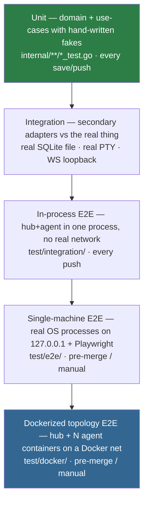
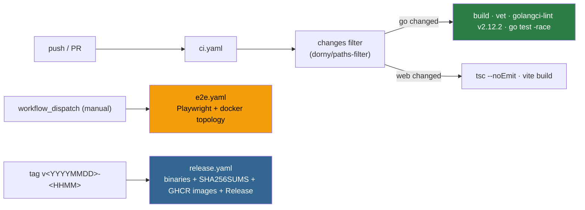

# 11 · Testing

Stability *is* the product — a terminal you can't trust is worse than none. Tests scale from
microsecond domain unit tests up to a Dockerized replica of the real multi-machine topology.

---

## The pyramid

Core principles (from the hexagon): **no mocks in the domain**; hand-written in-memory fakes for use
cases (the `secondary/memory` stores double as fakes); **adapters tested against the real thing** — a
SQL adapter tested against a mocked `*sql.DB` has tested nothing. Mock only ports we own, never
`*sql.DB` or sockets.

---

## What's real vs faked at each tier

| Tier | Directory | SQLite | Network | Agent/host | Browser |
|------|-----------|--------|---------|------------|---------|
| Unit | co-located `_test.go` | memory fakes | none | none | none |
| Integration / in-proc E2E | `test/integration/` | **real file** | `httptest.Server` (real WS/HTTP) | in-process | Go WS/HTTP client |
| Single-machine E2E | `test/e2e/` | real temp DB | real loopback WSS | real `constellate-hub`/`-agent` OS processes | **real Chromium (Playwright)** |
| Dockerized topology | `test/docker/` | real (in container) | real Docker bridge net | real agent **containers** | Playwright + Go client |

---

## In-process integration suite (`test/integration/`)

The load-bearing acceptance tests — real SQLite, real WS servers, agent/host wired in-process:

| File | Key tests | Asserts |
|------|-----------|---------|
| `enroll_test.go` | `TestEnrollAndConnect`, `TestRevokeBlocksDial` | full mint→enroll→authenticate→dial→online; a revoked machine can't dial |
| `terminal_test.go` | `TestTerminalLifecycle`, `TestSessionLostOnAgentRestart`, `TestSessionPwdFollowsCd` | create→attach→type→read→resize→detach→re-attach→close; same machineID + **different instanceID** ⇒ running sessions `lost`; live `pwd` tracks a real `cd` |
| `overview_test.go` | `TestOverviewSnapshotPipeline` | agent produces snapshots → hub ingests/fans out → subscriber receives the expected text/color |
| `projects_test.go` | `TestProjectsLifecycle` | REST lifecycle: create → list → duplicate `(machineID,path)` ⇒ 409 → PATCH missing session ⇒ 404 |
| `topology_test.go` | `TestDialHomeTopology` | dial-home / online→offline→online wiring |

---

## Docker topology (`test/docker/`)

- **`run.sh` + `compose.test.yaml`** — 1 hub + 2 real agent containers on a bridge net that can reach
  only the hub (mimicking NAT). Mints per-agent tokens via `docker compose exec hub
  constellate-hub enroll-token`; asserts online/offline by grepping the hub's structured logs; verifies
  reconnect after `stop`/`start`. Killing an agent **container** proves the session-host-death path:
  its sessions go `lost`, then it reconnects with a fresh `instanceID`.
- **`run_connect_restart.sh` + `compose.connect-restart.yaml` + `agent.supervisor.Dockerfile`** — the
  end-to-end proof of the [D8 split](03-agent-and-sessions.md): a supervisor-mode container (PID 1 = a
  shell, `connect` run in a restart loop) lets the test kill **only the connect PID**. It asserts the
  hub log **never** contains `process restart detected` between the two `agent online` events — i.e.
  the session-host survived and `instanceID` stayed stable.

---

## Single-machine E2E (`test/e2e/`)

`run.sh` builds real binaries, starts `constellate-hub serve` + one real `constellate-agent connect`
(temp DB + id/cred), bootstraps an operator (`operator add`, captures the TOTP secret), mints a token,
waits for `agent online`, then runs Playwright. `playwright.config.ts` has a `setup` project
(`browser/auth.setup.ts` logs in via TOTP, saves `storageState`) and a `chromium` project that reuses
it — nothing is mocked; real DB, real WS terminal (`browser/terminal.spec.ts`).

Frontend units run separately: `make test-web` → `cd web && npm run test:run` (vitest), covering
`paneTree`, `dnd`, `pwd`, `collapse`, and `paneActions`.

---

## CI (`​.github/workflows/`)

- **`ci.yaml`** (push to `main` + PR) — a `changes` filter gates two jobs: Go (`go build`, `go vet`,
  `golangci-lint-action` pinned to **v2.12.2** matching the Makefile, `go test ./... -race -count=1`)
  and frontend (`npm ci`, `tsc --noEmit`, `npm run build`). The Go job first `touch web/dist/.gitkeep`
  so `//go:embed all:dist` compiles without a real web build.
- **`e2e.yaml`** — `workflow_dispatch` only (to conserve Actions minutes): a browser-E2E job
  (`make test-e2e`) and a docker-topology job (`make test-docker`).
- **`release.yaml`** — narrow tag trigger `v[0-9]{8}-[0-9]*`; builds the web bundle, cross-compiles
  binaries, computes `SHA256SUMS`, generates AI release notes (non-fatal), and publishes the GitHub
  Release + multi-arch GHCR images. `concurrency` guards overlapping releases.

---

## Where to go next

- What the topology tests exercise: [02 · Architecture](02-architecture.md)
- The restart semantics they assert: [03 · Agent & sessions](03-agent-and-sessions.md)
- Release mechanics: [10 · Operations](10-operations.md)
