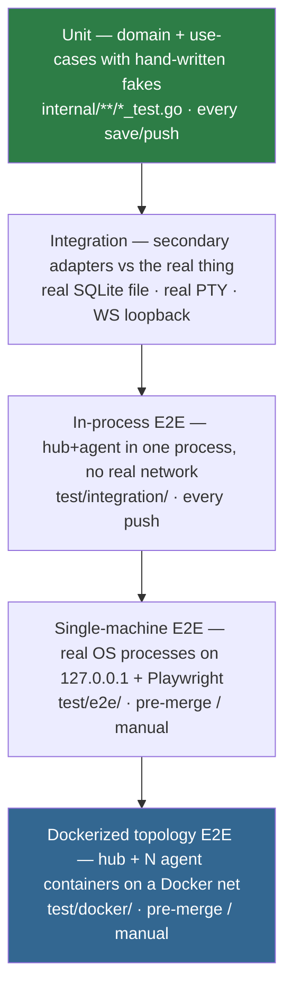
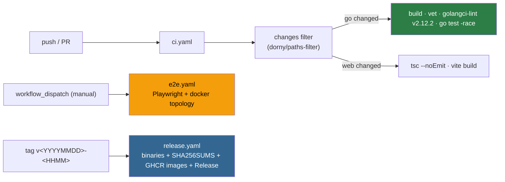

# 11 · Testing

Stability *is* the product — a terminal you can't trust is worse than none. Tests scale from
microsecond domain unit tests up to a Dockerized replica of the real multi-machine topology.

---

## The pyramid

```mermaid
graph TB
    U["Unit — domain + use-cases with hand-written fakes<br/>internal/**/*_test.go · every save/push"]
    I["Integration — secondary adapters vs the real thing<br/>real SQLite file · real PTY · WS loopback"]
    E["In-process E2E — hub+agent in one process, no real network<br/>test/integration/ · every push"]
    S["Single-machine E2E — real OS processes on 127.0.0.1 + Playwright<br/>test/e2e/ · pre-merge / manual"]
    D["Dockerized topology E2E — hub + N agent containers on a Docker net<br/>test/docker/ · pre-merge / manual"]
    U --> I --> E --> S --> D

    style U fill:#2d7d46,color:#fff
    style D fill:#336791,color:#fff
```

Core principles (from the hexagon): **no mocks in the domain**; hand-written in-memory fakes for use
cases (the `secondary/memory` stores double as fakes); **adapters tested against the real thing** — a
SQL adapter tested against a mocked `*sql.DB` has tested nothing. Mock only ports we own, never
`*sql.DB` or sockets.

---

## What's real vs faked at each tier

| Tier | Directory | SQLite | Network | Agent/host | Browser |
|------|-----------|--------|---------|------------|---------|
| Unit | co-located `_test.go` | memory fakes | none | none | none |
| Integration / in-proc E2E | `test/integration/` | **real file** | `httptest.Server` (real WS/HTTP) | in-process | Go WS/HTTP client |
| Single-machine E2E | `test/e2e/` | real temp DB | real loopback WSS | real `constellate-hub`/`-agent` OS processes | **real Chromium (Playwright)** |
| Dockerized topology | `test/docker/` | real (in container) | real Docker bridge net | real agent **containers** | Playwright + Go client |

---

## The test matrix

| Tier | Command | Covers | Files |
|---|---|---|---|
| Go unit | `go test ./...` (part of `make test`) | domain + use-case logic, hand-written fakes | co-located `internal/**/*_test.go` |
| Go integration / in-proc E2E | `make test` | real SQLite, real WS via `httptest.Server`, in-process hub+agent | `test/integration/*.go` — `enroll_test.go`, `terminal_test.go`, `terminal_keepalive_test.go`, `overview_test.go`, `projects_test.go`, `topology_test.go` |
| Frontend unit | `make test-web` → `cd web && npm run test:run` (vitest) | the pure modules: pane/window trees, store actions, reconnect policy, keypad layout, key sequences, touch scroll, sidebar ordering | `web/src/**/*.test.ts` (13 files) |
| E2E desktop | `make test-e2e` → `./test/e2e/run.sh` → `npx playwright test`, `chromium` project | real binaries, real loopback WSS, real Chromium | `terminal`, `session-settings`, `reconnect`, `agent-blip` specs + `helpers.ts` + `auth.setup.ts` |
| E2E mobile | same run, `mobile` project (`devices['Pixel 7']`, reports `isMobile`+`hasTouch` so Chromium exposes `pointer: coarse`) | phone drawer, MobilePane, keypad, touch scroll, PTY geometry | `responsive.spec.ts` only |
| Docker topology | `make test-docker` → `./test/docker/run.sh` | hub + 2 real agent containers, NAT-like bridge net, kill/restart, `instanceID` stability across connect-only restarts | `test/docker/*` |
| Lint | `make lint` | golangci-lint v2 (pinned to `v2.12.2`, see `.github/workflows/ci.yaml`) | repo-wide |
| CI cheap | `.github/workflows/ci.yaml` on push/PR | build/vet/lint/`go test -race`, `tsc --noEmit`, `vite build` | — |
| CI heavy | `.github/workflows/e2e.yaml`, `workflow_dispatch` only | `browser-e2e` job → `make test-e2e`; `docker-topology` job → `make test-docker` | — |

`test/e2e/run.sh` invokes `npx playwright test` unfiltered, so a plain `make test-e2e` runs **both**
the `chromium` and `mobile` projects; scope to just one with `npx playwright test --project=mobile`.

---

## In-process integration suite (`test/integration/`)

The load-bearing acceptance tests — real SQLite, real WS servers, agent/host wired in-process:

| File | Key tests | Asserts |
|------|-----------|---------|
| `enroll_test.go` | `TestEnrollAndConnect`, `TestRevokeBlocksDial` | full mint→enroll→authenticate→dial→online; a revoked machine can't dial |
| `terminal_test.go` | `TestTerminalLifecycle`, `TestSessionLostOnAgentRestart`, `TestSessionDisconnectedThenRestored`, `TestSessionPwdFollowsCd` | create→attach→type→read→resize→detach→re-attach→close; same machineID + **different instanceID** ⇒ running sessions `lost`; a hub-side link blip flips a session `running → disconnected → running`; live `pwd` tracks a real `cd` |
| `terminal_keepalive_test.go` | `TestTerminalKeepaliveHeartbeat` | the `/ws/term` `{"type":"hb","ts":…}` keepalive frame ([04 · Wire protocol](04-wire-protocol.md)) keeps flowing alongside live PTY traffic |
| `overview_test.go` | `TestOverviewSnapshotPipeline` | agent produces snapshots → hub ingests/fans out → subscriber receives the expected text/color |
| `projects_test.go` | `TestProjectsLifecycle` | REST lifecycle: create → list → duplicate `(machineID,path)` ⇒ 409 → PATCH missing session ⇒ 404 |
| `topology_test.go` | `TestDialHomeTopology` | dial-home / online→offline→online wiring |

---

## Docker topology (`test/docker/`)

- **`run.sh` + `compose.test.yaml`** — 1 hub + 2 real agent containers on a bridge net that can reach
  only the hub (mimicking NAT). Mints per-agent tokens via `docker compose exec hub
  constellate-hub enroll-token`; asserts online/offline by grepping the hub's structured logs; verifies
  reconnect after `stop`/`start`. Killing an agent **container** proves the session-host-death path:
  its sessions go `lost`, then it reconnects with a fresh `instanceID`.
- **`run_connect_restart.sh` + `compose.connect-restart.yaml` + `agent.supervisor.Dockerfile`** — the
  end-to-end proof of the [D8 split](03-agent-and-sessions.md): a supervisor-mode container (PID 1 = a
  shell, `connect` run in a restart loop) lets the test kill **only the connect PID**. It asserts the
  hub log **never** contains `process restart detected` between the two `agent online` events — i.e.
  the session-host survived and `instanceID` stayed stable.

---

## Single-machine E2E (`test/e2e/`)

`run.sh` builds real binaries, starts `constellate-hub serve` + one real `constellate-agent connect`
(temp DB + id/cred), bootstraps an operator (`operator add`, captures the TOTP secret), mints a token,
waits for `agent online`, then runs `npx playwright test` — nothing is mocked; real DB, real WS
terminal.

`playwright.config.ts` now defines **three** projects:

| Project | Emulation | Scope |
|---|---|---|
| `setup` | — | `testMatch: /auth\.setup\.ts/` — logs in via TOTP, saves `storageState` to `playwright/.auth/operator.json` |
| `chromium` | `devices['Desktop Chrome']` | `testIgnore: /responsive\.spec\.ts/` — every desktop spec except the mobile-only one |
| `mobile` | `devices['Pixel 7']` (reports `isMobile` + `hasTouch`, so Chromium exposes `pointer: coarse`) | `testMatch: /responsive\.spec\.ts/` — only that spec |

Both `chromium` and `mobile` depend on `setup` and reuse its `storageState`. `make test-e2e` runs
`npx playwright test` unfiltered, so it exercises both projects; scope to one with
`npx playwright test --project=mobile`.

`test/e2e/browser/` (specs plus shared fixtures):

| File | Project | Covers |
|---|---|---|
| `helpers.ts` | — (shared) | `onlineMachineId` polls `/api/machines` for the `e2e-box` agent coming online; `createRunningSession` seeds a live PTY via `POST /api/sessions`. Both are imported by the specs below rather than duplicated. |
| `auth.setup.ts` | `setup` | TOTP login → `storageState` |
| `terminal.spec.ts` | `chromium` | baseline live-terminal round-trip |
| `session-settings.spec.ts` | `chromium` | gear button on a sidebar row → settings modal → rename via the Name field + Save → sidebar reflects the new title → close the session via the two-step confirm |
| `reconnect.spec.ts` | `chromium` | pane self-heals after a raw WebSocket kill. Chromium's `context.setOffline()` does not sever an already-established socket, so the spec shims the `WebSocket` constructor to grab a handle to the live `/ws/term` socket and `.close()` it directly, then keeps `setOffline(true)` on so retries fail until it flips back. Asserts the `.pane-reconnecting` badge shows, the `online` listener reattaches once network returns, and scrollback replays **exactly once** (not doubled) |
| `agent-blip.spec.ts` | `chromium` | survives a hub↔agent link blip rather than a browser-side outage — intercepts the `/api/sessions` poll to flip this session's status `running → disconnected → running`, asserting the `.pane-ended` "Session disconnected" overlay shows then clears, and scrollback replays exactly once |
| `responsive.spec.ts` | `mobile` | largest spec: phone drawer sidebar, `MobilePane` leaf switcher, the in-app on-screen `Keypad` (driven via a `tapKeys(keypad, ids)` helper that taps keys in order by `data-key-id`), touch-swipe scroll on alt-screen TUIs, and PTY geometry via a `ptyGeometry(page, marker)` helper (reads `stty size` in-shell) staying stable across keypad layer switches — the interesting assertion is that a layer switch must never ResizeObserver-resize the PTY |

`reconnect.spec.ts` and `agent-blip.spec.ts` — together with `terminal_keepalive_test.go` above —
are precisely what tests the `/ws/term` keepalive + close-code contract documented in
[04 · Wire protocol](04-wire-protocol.md): the `{"type":"hb","ts":…}` frame, and close codes `4404`
(not found) / `4410` (session ended) as terminal vs. `4503` (agent offline) and others as retryable.

Frontend units run separately: `make test-web` → `cd web && npm run test:run` (vitest), 13 files
under `web/src/**/*.test.ts`:

| Area | Files |
|---|---|
| Workspace model | `terminal/paneTree`, `terminal/windowList`, `store/paneActions`, `terminal/dnd` |
| Connection policy | `api/reconnect` |
| Touch input | `terminal/keypadLayout`, `terminal/keys`, `terminal/inputMode`, `terminal/touchScroll` |
| Sidebar | `sidebar/order`, `sidebar/collapse`, `sidebar/sessionSettings` |
| Terminal chrome | `terminal/pwd` |

That every one of these is a **pure module** is the point, not an accident: the reconnect state
machine, the keypad layout, and the pane tree were each written as DOM-free functions specifically so
they could be tested this way instead of through a browser.

---

## CI (`​.github/workflows/`)

```mermaid
graph LR
    P["push / PR"] --> CI["ci.yaml"]
    CI --> CG["changes filter<br/>(dorny/paths-filter)"]
    CG -->|go changed| BT["build · vet · golangci-lint v2.12.2 · go test -race"]
    CG -->|web changed| FE["tsc --noEmit · vite build"]
    M["workflow_dispatch (manual)"] --> E2["e2e.yaml<br/>Playwright + docker topology"]
    TAG["tag v&lt;YYYYMMDD&gt;-&lt;HHMM&gt;"] --> REL["release.yaml<br/>binaries + SHA256SUMS + GHCR images + Release"]

    style BT fill:#2d7d46,color:#fff
    style E2 fill:#f59e0b,color:#000
    style REL fill:#336791,color:#fff
```

- **`ci.yaml`** (push to `main` + PR) — a `changes` filter gates two jobs: Go (`go build`, `go vet`,
  `golangci-lint-action` pinned to **v2.12.2** matching the Makefile, `go test ./... -race -count=1`)
  and frontend (`npm ci`, `tsc --noEmit`, `npm run build`). The Go job first `touch web/dist/.gitkeep`
  so `//go:embed all:dist` compiles without a real web build.
- **`e2e.yaml`** — `workflow_dispatch` only (to conserve Actions minutes): a browser-E2E job
  (`make test-e2e`) and a docker-topology job (`make test-docker`).
- **`release.yaml`** — narrow tag trigger `v[0-9]{8}-[0-9]*`; builds the web bundle, cross-compiles
  binaries, computes `SHA256SUMS`, generates AI release notes (non-fatal), and publishes the GitHub
  Release + multi-arch GHCR images. `concurrency` guards overlapping releases.

---

## Where to go next

- What the topology tests exercise: [02 · Architecture](02-architecture.md)
- The restart semantics they assert: [03 · Agent & sessions](03-agent-and-sessions.md)
- Release mechanics: [10 · Operations](10-operations.md)
