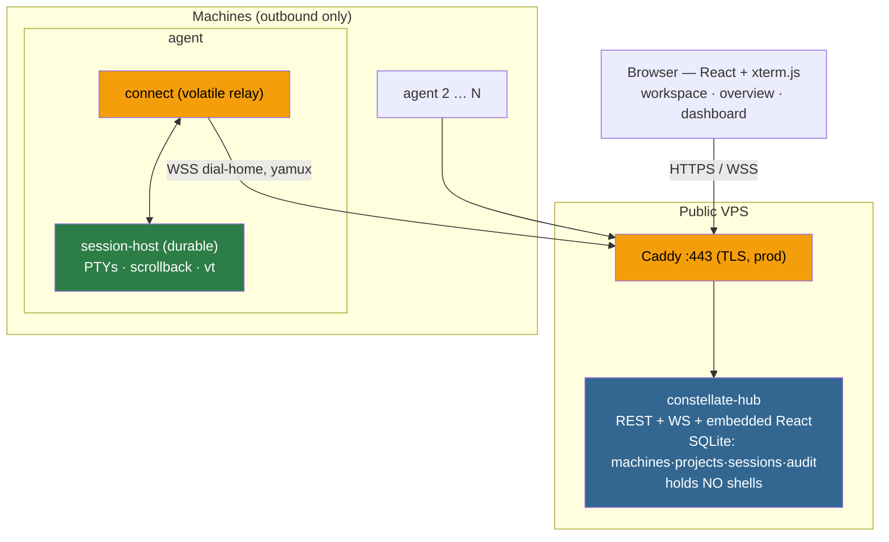
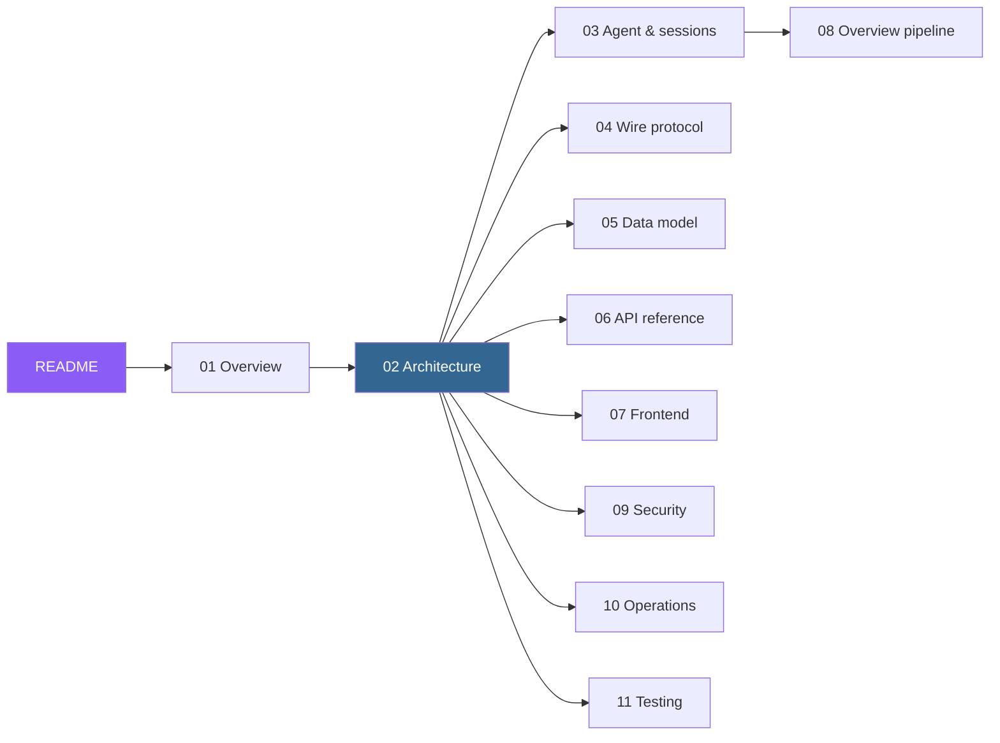

# Constellate documentation

A **diagram-first** tour of Constellate as it is actually implemented — grounded in the code, not in
any older description of it. Where the code and the older docs disagree, these pages document the code
and call the drift out explicitly (look for **⚠️ Drift** callouts).

> **Constellate** is a self-hosted control plane for a fleet of developer machines: one web UI, served
> from a public **hub**, giving a single operator live, persistent terminal access to every machine
> they own — grouped by project, with a mission-control overview of every running shell at a glance.

---

## The three ideas that explain everything else

If you read only this section, you can still navigate the codebase.

**1. Agents dial home; the hub holds no shells.** Every machine runs an agent that opens **one
outbound** TLS WebSocket to the public hub and multiplexes many [yamux](https://github.com/hashicorp/yamux)
streams over it (control, per-session data, snapshots). The hub never connects *into* a machine — dev
boxes need zero inbound ports and work behind NAT. The hub is a pure control plane and relay; the PTYs
live on the agents. This is why the whole system is *two hexagons* (`internal/hub`, `internal/agent`)
that share only `internal/transport` and `internal/platform` and never import each other.

**2. The agent is two processes, and one `instanceID` decides everything.** A durable **session-host**
owns the PTYs, scrollback, the vt emulator, and a machine-lifetime `instanceID`; a volatile **connect**
relay dials home and sources that `instanceID` over a local Unix socket. Kill and restart `connect`
(or `agent update`) and the hub sees the *same* `instanceID` → sessions stay `running`. Only when the
session-host itself dies (crash, reboot) does the `instanceID` change → sessions become `lost`. That
single comparison (`registry.Register`) is the hinge of the persistence story.

**3. The overview ships *screens*, not *output*.** Each agent parses PTY output into an in-repo vt
emulator that maintains a current screen grid. A change-gated, rate-capped, run-length-encoded snapshot
is sent **only while someone is watching** the overview. So a mission-control grid of every live
terminal costs near-constant bandwidth regardless of how busy the shells are — and **zero** when the
overview is closed.

---

## Whole-system view

---

## Reading order

| # | Doc | What it covers |
|---|-----|----------------|
| 01 | [Overview](01-overview.md) | what it is, the stack, goals/non-goals, where the code lives |
| 02 | [Architecture](02-architecture.md) | the two hexagons, layering, the bidirectional agent link, restart detection, deployment topology |
| 03 | [Agent & sessions](03-agent-and-sessions.md) | the session-host/connect split, the local UDS protocol, the session manager, scrollback, the vt emulator, activity |
| 04 | [Wire protocol](04-wire-protocol.md) | protocol v6, every message, the three streams, the Ed25519 bearer assertion, the RLE snapshot format |
| 05 | [Data model](05-data-model.md) | the SQLite schema, ERD, and the six migrations' evolution |
| 06 | [API reference](06-api-reference.md) | REST + WebSocket routes, auth gating, the error model |
| 07 | [Frontend](07-frontend.md) | the three views, split-pane workspace, terminal, overview, dashboard, auth UI |
| 08 | [Overview pipeline](08-overview-pipeline.md) | the signature snapshot pipeline and *why* it stays cheap |
| 09 | [Security](09-security.md) | enrollment, operator auth, TLS, rate limiting, the threat model |
| 10 | [Operations](10-operations.md) | config reference, Docker/binary/systemd, install/update, releases, troubleshooting |
| 11 | [Testing](11-testing.md) | the test pyramid, what's real vs faked, CI/CD |

---

## Task guides (hand-written, user-facing)

Step-by-step operator guides. The numbered docs above explain *how it works*; these explain *how to do
a thing*.

| Guide | For |
|-------|-----|
| [`usage.binary.md`](usage.binary.md) | Standing up the hub + agents from prebuilt binaries; full config, TLS, passkeys, fleet management |
| [`usage.docker.md`](usage.docker.md) | Running in containers — dev stack, prod stack with Caddy, and the bare-IP path |
| [`usage.agent.md`](usage.agent.md) | Bringing one machine online: enroll → connect → keep it running (systemd/launchd), the update story |
| [`shell-integration.md`](shell-integration.md) | Opt-in OSC 133 prompt markers (bash/zsh) for accurate activity badges |
| [`hub.shortcut.md`](hub.shortcut.md) | Every web-UI keyboard shortcut |
| [`design/session-survival-plan.md`](design/session-survival-plan.md) | The original implementation plan for the session-host/connect split (D8) — historical |

---

## A note on the older docs

The repo's `README.md`, `CLAUDE.md`, and `DESIGN.md` remain useful — `DESIGN.md` in particular carries
deep decision history (`§3` locked decisions, `§18` milestones). But they have drifted from the code in
a few specific places, flagged in the pages above:

- **Wire protocol is 6**, not "2" or "5" as `DESIGN.md` §6/§13 variously say — [04](04-wire-protocol.md).
- **The frontend stack is leaner** than `DESIGN.md` §13 (no TanStack Query / React Router / Tailwind /
  webgl addon; it does use `@dnd-kit`) — [01](01-overview.md) / [07](07-frontend.md).
- **The auth routes** are more numerous and nested than `DESIGN.md` §9 lists — [06](06-api-reference.md).
- **The auto-spawn file** is `spawn_unix.go`, not `spawn_linux.go` — [03](03-agent-and-sessions.md).

When in doubt, the code wins.
